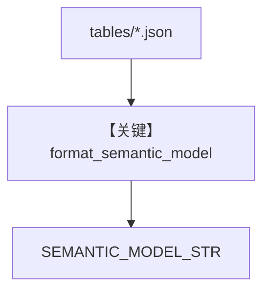

# semantic_model.py — 实现原理分析

<!-- cookbook-py-source:start -->
## 完整源码

```python
"""Load table metadata for the system prompt."""

import json
from pathlib import Path
from typing import Any

from agno.utils.log import logger

from ..paths import TABLES_DIR

MAX_QUALITY_NOTES = 5


def load_table_metadata(tables_dir: Path | None = None) -> list[dict[str, Any]]:
    """Load table metadata from JSON files."""
    if tables_dir is None:
        tables_dir = TABLES_DIR

    tables: list[dict[str, Any]] = []
    if not tables_dir.exists():
        return tables

    for filepath in sorted(tables_dir.glob("*.json")):
        try:
            with open(filepath) as f:
                table = json.load(f)
            tables.append(
                {
                    "table_name": table["table_name"],
                    "description": table.get("table_description", ""),
                    "use_cases": table.get("use_cases", []),
                    "data_quality_notes": table.get("data_quality_notes", [])[
                        :MAX_QUALITY_NOTES
                    ],
                }
            )
        except (json.JSONDecodeError, KeyError, OSError) as e:
            logger.error(f"Failed to load {filepath}: {e}")

    return tables


def build_semantic_model(tables_dir: Path | None = None) -> dict[str, Any]:
    """Build semantic model from table metadata."""
    return {"tables": load_table_metadata(tables_dir)}


def format_semantic_model(model: dict[str, Any]) -> str:
    """Format semantic model for system prompt."""
    lines: list[str] = []

    for table in model.get("tables", []):
        lines.append(f"### {table['table_name']}")
        if table.get("description"):
            lines.append(table["description"])
        if table.get("use_cases"):
            lines.append(f"**Use cases:** {', '.join(table['use_cases'])}")
        if table.get("data_quality_notes"):
            lines.append("**Data quality:**")
            for note in table["data_quality_notes"]:
                lines.append(f"  - {note}")
        lines.append("")

    return "\n".join(lines)


SEMANTIC_MODEL = build_semantic_model()
SEMANTIC_MODEL_STR = format_semantic_model(SEMANTIC_MODEL)
```

<!-- cookbook-py-source:end -->

> 源文件：`cookbook/01_demo/agents/dash/context/semantic_model.py`

## 概述

本文件从 `knowledge/tables/*.json` 加载**表级元数据**，**`format_semantic_model`** 转为可读 Markdown，**`SEMANTIC_MODEL_STR`** 供 **`dash/agent.py` instructions** 中 **`{SEMANTIC_MODEL_STR}`** 展开，使模型掌握表用途与数据质量提示。

**核心配置一览：** 无 Agent；导出 **`SEMANTIC_MODEL_STR`**。

## 架构分层

```
tables/*.json → load_table_metadata → format_semantic_model → SEMANTIC_MODEL_STR
```

## 核心组件解析

### load_table_metadata

读取每张表的 `table_name`、`table_description`、`use_cases`、`data_quality_notes`（截断至 `MAX_QUALITY_NOTES`）。

### 运行机制与因果链

1. **路径**：静态 JSON → import 时进入 Dash 的 instructions。
2. **副作用**：无。
3. **分支**：目录不存在则空列表（L20-L21）。

## System Prompt 组装

作为 **`instructions` 内嵌块**，见 `agent.py` 中 `## SEMANTIC MODEL` 段。

### 还原后的完整 System 文本

取决于 `knowledge/tables` 下 JSON；无文件时 `SEMANTIC_MODEL_STR` 近似空。

## 完整 API 请求

无。

## Mermaid 流程图



## 关键源码文件索引

| 文件 | 关键函数/类 | 作用 |
|------|------------|------|
| `semantic_model.py` | `format_semantic_model()` L48 | 表语义格式化 |
