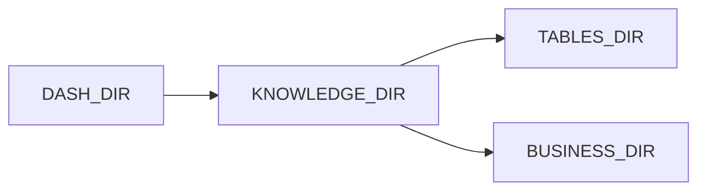

# paths.py — 实现原理分析

> 源文件：`cookbook/01_demo/agents/dash/paths.py`

## 概述

本文件仅定义 **Dash** 知识资源目录的 **`Path` 常量**（`KNOWLEDGE_DIR`、`TABLES_DIR`、`BUSINESS_DIR`、`QUERIES_DIR`），供 `context/*.py` 与 `scripts/load_knowledge.py` 引用，**无 Agent、无 API**。

**核心配置一览：** 无。

## 架构分层

```
Path(__file__).parent → DASH_DIR → 各子目录常量
```

## 核心组件解析

集中路径避免硬编码，便于脚本与加载逻辑复用。

### 运行机制与因果链

纯常量模块，无运行时分支。

## System Prompt 组装

不适用。

## 完整 API 请求

不适用。

## Mermaid 流程图



## 关键源码文件索引

| 文件 | 关键函数/类 | 作用 |
|------|------------|------|
| `paths.py` | `DASH_DIR` 等 | 路径常量 |
