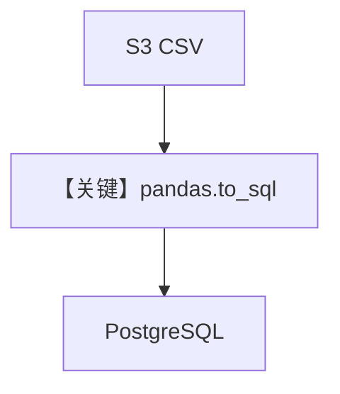

# load_data.py — 实现原理分析

> 源文件：`cookbook/01_demo/agents/dash/scripts/load_data.py`

## 概述

本脚本从 **S3 公开 CSV** 下载 F1 数据，用 **pandas + SQLAlchemy** 写入 **`db_url`** 指向的 PostgreSQL（`if_exists="replace"`）。**独立运维脚本**，不参与 Agent `run` 或 system 拼装。

**核心配置一览：** 无 Agent；使用环境变量 **`DATABASE_URL`**（经 `db.db_url`）。

## 架构分层

```
httpx GET CSV → pandas.read_csv → DataFrame.to_sql → PostgreSQL 表
```

## 核心组件解析

`TABLES` 字典映射表名到 URL；`__main__` 循环加载并打印行数（`load_data.py` L24-L36）。

### 运行机制与因果链

1. **路径**：网络 → 本地 DataFrame → DB。
2. **副作用**：**覆盖**已有表；行数累计打印。
3. **分支**：网络失败则异常退出（未在脚本内捕获）。

## System Prompt 组装

不适用。

## 完整 API 请求

仅 **HTTP GET** CSV，无 LLM。

## Mermaid 流程图



## 关键源码文件索引

| 文件 | 关键函数/类 | 作用 |
|------|------------|------|
| `cookbook/01_demo/db.py` | `db_url` | 连接串 |
| `load_data.py` | `__main__` L24+ | 批量灌表 |
