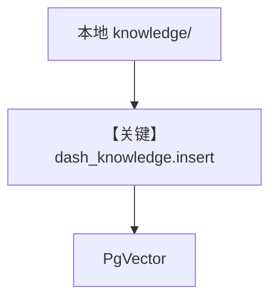

# load_knowledge.py — 实现原理分析

> 源文件：`cookbook/01_demo/agents/dash/scripts/load_knowledge.py`

## 概述

本脚本将 `knowledge/{tables,queries,business}` 下文件 **批量 `insert` 进 `dash_knowledge` 向量库**；可选 **`--recreate`** 删除重建向量表。供 **Dash agentic 检索** 使用，**非**运行时自动执行。

**核心配置一览：** 无 Agent；导入 **`dash.agent` 中的 `dash_knowledge`**（副作用：加载 agent 模块）。

## 架构分层

```
argparse → 可选 drop/create 向量表 → 按子目录 knowledge.insert(path=...)
```

## 核心组件解析

遍历 `tables`、`queries`、`business` 子目录，对每个非空目录调用 `dash_knowledge.insert(name="knowledge-{subdir}", path=...)`（`load_knowledge.py` L32-L45）。

### 运行机制与因果链

1. **副作用**：写入 PgVector 与 contents 表；`--recreate` 破坏性重建。
2. **分支**：子目录不存在则跳过并打印。

## System Prompt 组装

不适用；检索内容影响的是 **#3.3.13** 动态段与向量命中，而非本脚本。

## 完整 API 请求

无 LLM；仅有 **向量库写入**。

## Mermaid 流程图



## 关键源码文件索引

| 文件 | 关键函数/类 | 作用 |
|------|------------|------|
| `agno/knowledge/knowledge.py` | `insert` | 目录入库 |
