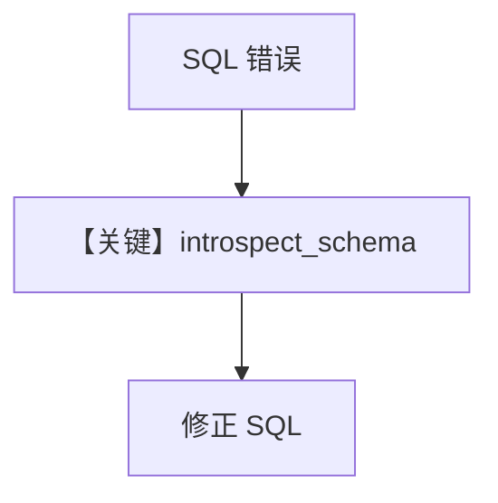

# introspect.py — 实现原理分析

> 源文件：`cookbook/01_demo/agents/dash/tools/introspect.py`

## 概述

**工厂 `create_introspect_schema_tool(db_url)`** 返回 **`introspect_schema`** 工具：用 **SQLAlchemy `inspect`** 列出表、列、可选样例行，供 Dash 在 SQL 报错后**运行时自省**；经 **`@tool`** 注册进 Agent。

**核心配置一览：** 无 Agent；工具在 `dash/agent.py` 中装入 `dash_tools`。

## 架构分层

```
Agent get_tools → Function(introspect_schema) → SQLAlchemy engine → 元数据字符串
```

## 核心组件解析

### introspect_schema

- `table_name is None`：列出所有表及行数估算（`introspect.py` L29-44）。
- 指定表：列类型、可空、样例（后续行 L50+）。

### 运行机制与因果链

1. **路径**：模型发起 tool call → 执行 Python → 返回 Markdown 字符串 → 进入下一轮消息。
2. **副作用**：**只读**查询 `COUNT(*)`；无 DDL。
3. **分支**：表不存在返回可用表列表。

## System Prompt 组装

工具**描述在 docstring**，由 `get_tools` 进入 **tools schema**；不单独占一段「system 正文」，但影响模型如何选工具。

### 还原后的完整 System 文本

不适用独立 system；**instructions** 要求出错时调用 introspect（见 Dash `agent.py`）。

## 完整 API 请求

无直接 LLM；工具结果作为 **user/tool 消息** 回到 Responses 调用链。

## Mermaid 流程图



## 关键源码文件索引

| 文件 | 关键函数/类 | 作用 |
|------|------------|------|
| `agno/tools/decorator.py` | `@tool` | 注册可调用 |
| `introspect.py` | `create_introspect_schema_tool` L9 | 闭包绑定 db_url |
