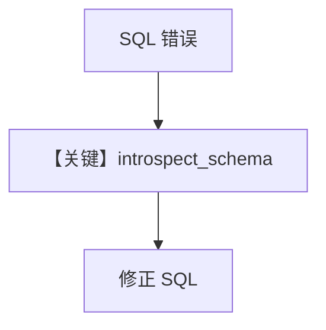

# introspect.py — 实现原理分析

<!-- cookbook-py-source:start -->
## 完整源码

```python
"""Runtime schema inspection (Layer 6)."""

from agno.tools import tool
from agno.utils.log import logger
from sqlalchemy import create_engine, inspect, text
from sqlalchemy.exc import DatabaseError, OperationalError


def create_introspect_schema_tool(db_url: str):
    """Create introspect_schema tool with database connection."""
    engine = create_engine(db_url)

    @tool
    def introspect_schema(
        table_name: str | None = None,
        include_sample_data: bool = False,
        sample_limit: int = 5,
    ) -> str:
        """Inspect database schema at runtime.

        Args:
            table_name: Table to inspect. If None, lists all tables.
            include_sample_data: Include sample rows.
            sample_limit: Number of sample rows.
        """
        try:
            insp = inspect(engine)

            if table_name is None:
                tables = insp.get_table_names()
                if not tables:
                    return "No tables found."

                lines = ["## Tables", ""]
                for t in sorted(tables):
                    try:
                        with engine.connect() as conn:
                            count = conn.execute(
                                text(f'SELECT COUNT(*) FROM "{t}"')
                            ).scalar()
                            lines.append(f"- **{t}** ({count:,} rows)")
                    except (OperationalError, DatabaseError):
                        lines.append(f"- **{t}**")
                return "\n".join(lines)

            tables = insp.get_table_names()
            if table_name not in tables:
                return f"Table '{table_name}' not found. Available: {', '.join(sorted(tables))}"

            lines = [f"## {table_name}", ""]

            cols = insp.get_columns(table_name)
            if cols:
                lines.extend(
                    [
                        "### Columns",
                        "",
                        "| Column | Type | Nullable |",
                        "| --- | --- | --- |",
                    ]
                )
                for c in cols:
                    nullable = "Yes" if c.get("nullable", True) else "No"
                    lines.append(f"| {c['name']} | {c['type']} | {nullable} |")
                lines.append("")

            pk = insp.get_pk_constraint(table_name)
            if pk and pk.get("constrained_columns"):
                lines.append(f"**Primary Key:** {', '.join(pk['constrained_columns'])}")
                lines.append("")

            if include_sample_data:
                lines.append("### Sample")
                try:
                    with engine.connect() as conn:
                        result = conn.execute(
                            text(f'SELECT * FROM "{table_name}" LIMIT {sample_limit}')
                        )
                        rows = result.fetchall()
                        col_names = list(result.keys())
                        if rows:
                            lines.append("| " + " | ".join(col_names) + " |")
                            lines.append(
                                "| " + " | ".join(["---"] * len(col_names)) + " |"
                            )
                            for row in rows:
                                vals = [str(v)[:30] if v else "NULL" for v in row]
                                lines.append("| " + " | ".join(vals) + " |")
                        else:
                            lines.append("_No data_")
                except (OperationalError, DatabaseError) as e:
                    lines.append(f"_Error: {e}_")

            return "\n".join(lines)

        except OperationalError as e:
            logger.error(f"Database connection failed: {e}")
            return f"Error: Database connection failed - {e}"
        except DatabaseError as e:
            logger.error(f"Database error: {e}")
            return f"Error: {e}"

    return introspect_schema
```

<!-- cookbook-py-source:end -->

> 源文件：`cookbook/01_demo/agents/dash/tools/introspect.py`

## 概述

**工厂 `create_introspect_schema_tool(db_url)`** 返回 **`introspect_schema`** 工具：用 **SQLAlchemy `inspect`** 列出表、列、可选样例行，供 Dash 在 SQL 报错后**运行时自省**；经 **`@tool`** 注册进 Agent。

**核心配置一览：** 无 Agent；工具在 `dash/agent.py` 中装入 `dash_tools`。

## 架构分层

```
Agent get_tools → Function(introspect_schema) → SQLAlchemy engine → 元数据字符串
```

## 核心组件解析

### introspect_schema

- `table_name is None`：列出所有表及行数估算（`introspect.py` L29-44）。
- 指定表：列类型、可空、样例（后续行 L50+）。

### 运行机制与因果链

1. **路径**：模型发起 tool call → 执行 Python → 返回 Markdown 字符串 → 进入下一轮消息。
2. **副作用**：**只读**查询 `COUNT(*)`；无 DDL。
3. **分支**：表不存在返回可用表列表。

## System Prompt 组装

工具**描述在 docstring**，由 `get_tools` 进入 **tools schema**；不单独占一段「system 正文」，但影响模型如何选工具。

### 还原后的完整 System 文本

不适用独立 system；**instructions** 要求出错时调用 introspect（见 Dash `agent.py`）。

## 完整 API 请求

无直接 LLM；工具结果作为 **user/tool 消息** 回到 Responses 调用链。

## Mermaid 流程图



## 关键源码文件索引

| 文件 | 关键函数/类 | 作用 |
|------|------------|------|
| `agno/tools/decorator.py` | `@tool` | 注册可调用 |
| `introspect.py` | `create_introspect_schema_tool` L9 | 闭包绑定 db_url |
