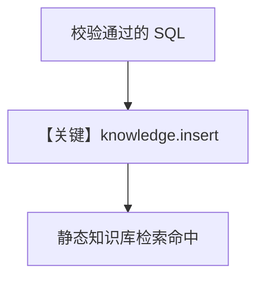

# save_query.py — 实现原理分析

> 源文件：`cookbook/01_demo/agents/dash/tools/save_query.py`

## 概述

**`create_save_validated_query_tool(knowledge)`** 生成 **`save_validated_query`**：仅允许 **SELECT/WITH**，过滤危险关键字，将 JSON 载荷 **`knowledge.insert`** 入库，供日后 **search_knowledge** 复用。

**核心配置一览：** 注入 `dash_knowledge`（`agent.py`）。

## 架构分层

```
模型调用 save_validated_query → 校验 SQL → TextReader + insert → PgVector
```

## 核心组件解析

校验逻辑见 `save_query.py` L42-L57；payload 含 `validated_query` 元数据（L59+）。

### 运行机制与因果链

1. **副作用**：向量库新增一条可检索内容。
2. **分支**：非 SELECT 或含危险词则返回错误字符串，不写入。

## System Prompt 组装

工具 docstring 进入 **function 定义**；业务上配合 Dash instructions 中「成功后可 save_validated_query」。

## 完整 API 请求

工具内无 LLM。

## Mermaid 流程图



## 关键源码文件索引

| 文件 | 关键函数/类 | 作用 |
|------|------------|------|
| `save_query.py` | `create_save_validated_query_tool` L11 | 闭包 + 校验 |
