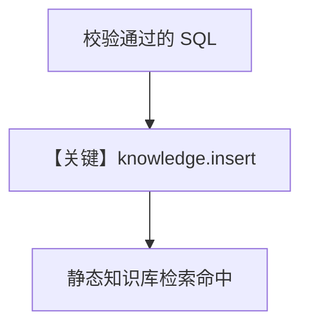

# save_query.py — 实现原理分析

<!-- cookbook-py-source:start -->
## 完整源码

```python
"""Save validated SQL queries to knowledge base."""

import json

from agno.knowledge import Knowledge
from agno.knowledge.reader.text_reader import TextReader
from agno.tools import tool
from agno.utils.log import logger


def create_save_validated_query_tool(knowledge: Knowledge):
    """Create save_validated_query tool with knowledge injected."""

    @tool
    def save_validated_query(
        name: str,
        question: str,
        query: str,
        summary: str | None = None,
        tables_used: list[str] | None = None,
        data_quality_notes: str | None = None,
    ) -> str:
        """Save a validated SQL query to knowledge base.

        Call ONLY after query executed successfully and user confirmed results.

        Args:
            name: Short name (e.g., "championship_wins_by_driver")
            question: Original user question
            query: The SQL query
            summary: What the query does
            tables_used: Tables used
            data_quality_notes: Data quality issues handled
        """
        if not name or not name.strip():
            return "Error: Name required."
        if not question or not question.strip():
            return "Error: Question required."
        if not query or not query.strip():
            return "Error: Query required."

        sql = query.strip().lower()
        if not sql.startswith("select") and not sql.startswith("with"):
            return "Error: Only SELECT queries can be saved."

        dangerous = [
            "drop",
            "delete",
            "truncate",
            "insert",
            "update",
            "alter",
            "create",
        ]
        for kw in dangerous:
            if f" {kw} " in f" {sql} ":
                return f"Error: Query contains dangerous keyword: {kw}"

        payload = {
            "type": "validated_query",
            "name": name.strip(),
            "question": question.strip(),
            "query": query.strip(),
            "summary": summary.strip() if summary else None,
            "tables_used": tables_used or [],
            "data_quality_notes": data_quality_notes.strip()
            if data_quality_notes
            else None,
        }
        payload = {k: v for k, v in payload.items() if v is not None}

        try:
            knowledge.insert(
                name=name.strip(),
                text_content=json.dumps(payload, ensure_ascii=False, indent=2),
                reader=TextReader(),
                skip_if_exists=True,
            )
            return f"Saved query '{name}' to knowledge base."
        except (AttributeError, TypeError, ValueError, OSError) as e:
            logger.error(f"Failed to save query: {e}")
            return f"Error: {e}"

    return save_validated_query
```

<!-- cookbook-py-source:end -->

> 源文件：`cookbook/01_demo/agents/dash/tools/save_query.py`

## 概述

**`create_save_validated_query_tool(knowledge)`** 生成 **`save_validated_query`**：仅允许 **SELECT/WITH**，过滤危险关键字，将 JSON 载荷 **`knowledge.insert`** 入库，供日后 **search_knowledge** 复用。

**核心配置一览：** 注入 `dash_knowledge`（`agent.py`）。

## 架构分层

```
模型调用 save_validated_query → 校验 SQL → TextReader + insert → PgVector
```

## 核心组件解析

校验逻辑见 `save_query.py` L42-L57；payload 含 `validated_query` 元数据（L59+）。

### 运行机制与因果链

1. **副作用**：向量库新增一条可检索内容。
2. **分支**：非 SELECT 或含危险词则返回错误字符串，不写入。

## System Prompt 组装

工具 docstring 进入 **function 定义**；业务上配合 Dash instructions 中「成功后可 save_validated_query」。

## 完整 API 请求

工具内无 LLM。

## Mermaid 流程图



## 关键源码文件索引

| 文件 | 关键函数/类 | 作用 |
|------|------------|------|
| `save_query.py` | `create_save_validated_query_tool` L11 | 闭包 + 校验 |
