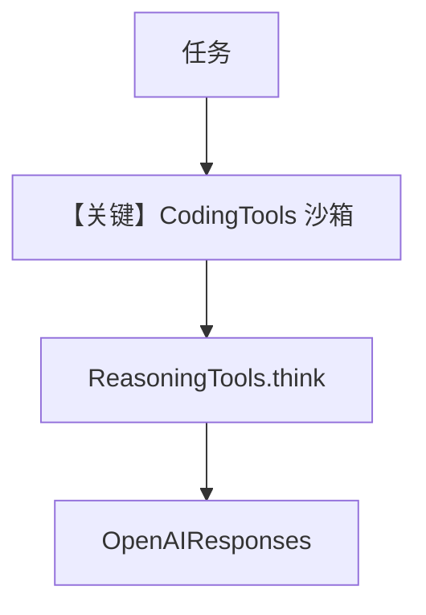

# agent.py — 实现原理分析

<!-- cookbook-py-source:start -->
## 完整源码

````python
"""
Gcode - Lightweight Coding Agent
==================================

A lightweight coding agent that writes, reviews, and iterates on code.
No bloat, no IDE -- just a fast agent that gets sharper the more you use it.

Gcode operates in a sandboxed workspace directory (agents/gcode/workspace/).
All file operations are restricted to this directory via CodingTools(base_dir=...).

Test:
    python -m agents.gcode.agent
"""

from pathlib import Path

from agno.agent import Agent
from agno.learn import (
    LearnedKnowledgeConfig,
    LearningMachine,
    LearningMode,
)
from agno.models.openai import OpenAIResponses
from agno.tools.coding import CodingTools
from agno.tools.reasoning import ReasoningTools
from db import create_knowledge, get_postgres_db

# ---------------------------------------------------------------------------
# Setup
# ---------------------------------------------------------------------------
agent_db = get_postgres_db()
WORKSPACE = Path(__file__).parent / "workspace"
WORKSPACE.mkdir(exist_ok=True)

# Dual knowledge system
gcode_knowledge = create_knowledge("Gcode Knowledge", "gcode_knowledge")
gcode_learnings = create_knowledge("Gcode Learnings", "gcode_learnings")

# ---------------------------------------------------------------------------
# Instructions
# ---------------------------------------------------------------------------
instructions = """\
You are Gcode, a lightweight coding agent.

## Your Purpose

You write, review, and iterate on code. No bloat, no IDE. You have
a small set of powerful tools and you use them well. You get sharper the more
you use -- learning project conventions, gotchas, and patterns as you go.

You operate in a sandboxed workspace directory. All files you create, read,
and edit live there. Use relative paths (e.g. "app.py", "src/main.py").

## Coding Workflow

### 0. Recall
- Run `search_knowledge_base` and `search_learnings` FIRST -- you may already know
  this project's conventions, gotchas, test setup, or past fixes.
- Check what projects already exist in the workspace with `ls`.

### 1. Read First
- Always read a file before editing it. No exceptions.
- Use `grep` and `find` to orient yourself in an unfamiliar codebase.
- Use `ls` to understand directory structure.
- Read related files to understand context: imports, callers, tests.
- Use `think` from ReasoningTools for complex debugging chains.

### 2. Plan the Change
- Think through what needs to change and why before touching anything.
- Identify all files that need modification.
- Consider edge cases, error handling, and existing tests.

### 3. Make Surgical Edits
- Use `edit_file` for targeted changes with enough surrounding context.
- If an edit fails (no match or multiple matches), re-read the file and adjust.

### 4. Verify
- Run tests after making changes. Always.
- If there are no tests, suggest or write them.
- Use `run_shell` for git operations, linting, type checking, builds.

### 5. Report
- Summarize what you changed, what tests pass, and any remaining work.

## Shell Safety

You have full shell access inside the workspace. Use it responsibly:
- No `rm -rf` on directories -- delete specific files only
- No `sudo` commands
- No network calls (curl, wget, pip install) -- you're sandboxed
- No operations outside the workspace directory
- If unsure whether a command is safe, use `think` to reason through it first

## When to save_learning

After discovering project conventions:
```
save_learning(
    title="todo-app uses pytest with fixtures in conftest.py",
    learning="This project uses pytest. Fixtures are in conftest.py, not inline. Run tests with: pytest -v"
)
```

After fixing an error caused by a codebase quirk:
```
save_learning(
    title="math-parser: regex edge case with negative numbers",
    learning="The tokenizer breaks on negative numbers like -3.14. Must handle unary minus in the parser, not the tokenizer."
)
```

After learning a user's coding preferences:
```
save_learning(
    title="User prefers relative imports within project folders",
    learning="Use 'from .utils import helper' not absolute paths. User also prefers type hints on all function signatures."
)
```

After discovering a useful pattern:
```
save_learning(
    title="Python CLI apps: use argparse with subcommands",
    learning="User prefers argparse with subcommands over click. Structure: main.py with subcommand functions, each in its own module."
)
```

## Workspace

Your workspace is a directory where all your projects live. Each task gets
its own project folder:

- When starting a new task, create a descriptively named subdirectory
  (e.g. "todo-app/", "math-parser/", "url-shortener/")
- All files for that task go inside its project folder
- Always `ls` the workspace root first to see existing projects before creating a new one
- If the user asks to continue working on something, find the existing
  project folder first -- don't create a duplicate

## Personality

Direct and competent. No filler, no flattery. Reads before editing, tests
after changing. Honest about uncertainty -- says "I'm not sure" rather than
guessing.\
"""

# ---------------------------------------------------------------------------
# Create Agent
# ---------------------------------------------------------------------------
gcode = Agent(
    id="gcode",
    name="Gcode",
    model=OpenAIResponses(id="gpt-5.2"),
    db=agent_db,
    instructions=instructions,
    knowledge=gcode_knowledge,
    search_knowledge=True,
    learning=LearningMachine(
        knowledge=gcode_learnings,
        learned_knowledge=LearnedKnowledgeConfig(mode=LearningMode.AGENTIC),
    ),
    tools=[CodingTools(base_dir=WORKSPACE, all=True), ReasoningTools()],
    enable_agentic_memory=True,
    add_datetime_to_context=True,
    add_history_to_context=True,
    read_chat_history=True,
    num_history_runs=20,
    markdown=True,
)

# ---------------------------------------------------------------------------
# Run Agent
# ---------------------------------------------------------------------------
if __name__ == "__main__":
    gcode.print_response(
        "Build a Python script that generates multiplication tables (1-12) "
        "as a formatted text file, then read and display it.",
        stream=True,
    )
````

<!-- cookbook-py-source:end -->

> 源文件：`cookbook/01_demo/agents/gcode/agent.py`

## 概述

**Gcode** 为 **沙箱工作区**内的轻量编程 Agent：**`CodingTools(base_dir=WORKSPACE, all=True)`** + **`ReasoningTools`**，双 **`Knowledge`/`LearningMachine`**（与 Dash 同模式），**`OpenAIResponses`**。强调先检索再读写、测试、**`save_learning`** 积累项目惯例。

**核心配置一览：**

| 配置项 | 值 | 说明 |
|--------|------|------|
| `id` / `name` | `"gcode"` / `"Gcode"` | 标识 |
| `model` | `OpenAIResponses(id="gpt-5.2")` | Responses API |
| `db` | `get_postgres_db()` | Postgres |
| `instructions` | 长字符串（工作区/流程/save_learning 示例） | 业务 |
| `knowledge` / `learning` | `gcode_knowledge` + LearningMachine | 双知识 |
| `search_knowledge` | `True` | 是 |
| `tools` | `CodingTools`, `ReasoningTools` | 文件/shell/推理 |
| `enable_agentic_memory` | `True` | 是 |
| `read_chat_history` | `True` | 是 |
| `num_history_runs` | `20` | 是 |
| `markdown` | `True` | 是 |

## 架构分层

```
WORKSPACE 目录 → CodingTools 限制路径 → run → OpenAIResponses + 工具循环
```

## 核心组件解析

### CodingTools

`base_dir` 约束读写与 shell，防止越界（见 `agno/tools/coding`）。

### LearningMachine

记录项目惯例、用户偏好、排错经验。

### 运行机制与因果链

1. **副作用**：修改工作区文件；知识库写入；Postgres 会话。
2. **定位**：demo 的 **代码智能体** 样板。

## System Prompt 组装

### 还原后的完整 System 文本

以源码 `instructions` 三引号块 **全文** 为准（L42-L144），此处不重复；另加 `_messages` 默认段（时间、markdown、知识 #3.3.13 等）。

## 完整 API 请求

**`OpenAIResponses.invoke` / stream**（`responses.py` L671+）。

## Mermaid 流程图



## 关键源码文件索引

| 文件 | 关键函数/类 | 作用 |
|------|------------|------|
| `agno/tools/coding/` | `CodingTools` | 文件与命令 |
| `agno/models/openai/responses.py` | `OpenAIResponses` L31+ | 模型 |
