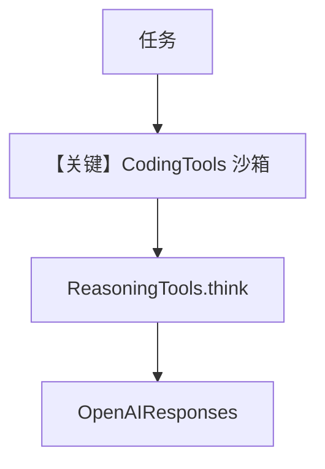

# agent.py — 实现原理分析

> 源文件：`cookbook/01_demo/agents/gcode/agent.py`

## 概述

**Gcode** 为 **沙箱工作区**内的轻量编程 Agent：**`CodingTools(base_dir=WORKSPACE, all=True)`** + **`ReasoningTools`**，双 **`Knowledge`/`LearningMachine`**（与 Dash 同模式），**`OpenAIResponses`**。强调先检索再读写、测试、**`save_learning`** 积累项目惯例。

**核心配置一览：**

| 配置项 | 值 | 说明 |
|--------|------|------|
| `id` / `name` | `"gcode"` / `"Gcode"` | 标识 |
| `model` | `OpenAIResponses(id="gpt-5.2")` | Responses API |
| `db` | `get_postgres_db()` | Postgres |
| `instructions` | 长字符串（工作区/流程/save_learning 示例） | 业务 |
| `knowledge` / `learning` | `gcode_knowledge` + LearningMachine | 双知识 |
| `search_knowledge` | `True` | 是 |
| `tools` | `CodingTools`, `ReasoningTools` | 文件/shell/推理 |
| `enable_agentic_memory` | `True` | 是 |
| `read_chat_history` | `True` | 是 |
| `num_history_runs` | `20` | 是 |
| `markdown` | `True` | 是 |

## 架构分层

```
WORKSPACE 目录 → CodingTools 限制路径 → run → OpenAIResponses + 工具循环
```

## 核心组件解析

### CodingTools

`base_dir` 约束读写与 shell，防止越界（见 `agno/tools/coding`）。

### LearningMachine

记录项目惯例、用户偏好、排错经验。

### 运行机制与因果链

1. **副作用**：修改工作区文件；知识库写入；Postgres 会话。
2. **定位**：demo 的 **代码智能体** 样板。

## System Prompt 组装

### 还原后的完整 System 文本

以源码 `instructions` 三引号块 **全文** 为准（L42-L144），此处不重复；另加 `_messages` 默认段（时间、markdown、知识 #3.3.13 等）。

## 完整 API 请求

**`OpenAIResponses.invoke` / stream**（`responses.py` L671+）。

## Mermaid 流程图



## 关键源码文件索引

| 文件 | 关键函数/类 | 作用 |
|------|------------|------|
| `agno/tools/coding/` | `CodingTools` | 文件与命令 |
| `agno/models/openai/responses.py` | `OpenAIResponses` L31+ | 模型 |
