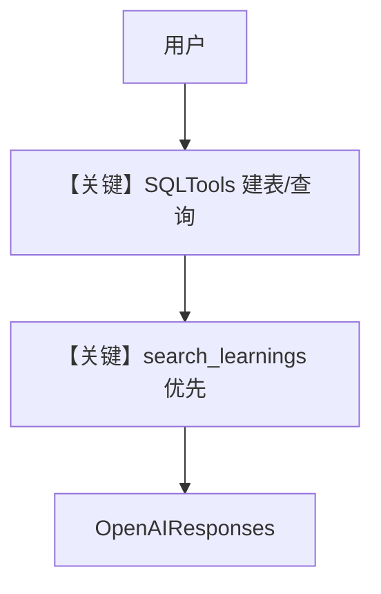

# agent.py — 实现原理分析

> 源文件：`cookbook/01_demo/agents/pal/agent.py`

## 概述

**Pal** 为 **个人代理**：**`SQLTools`** 在用户 Postgres 中建表/查改 **`pal_*` 数据**，**`MCPTools(Exa)`** 做网页检索；**双 Knowledge + LearningMachine** 区分「用户数据」与「关于用户的元知识」。**`contents_table="pal_contents"`** 隔离内容表。

**核心配置一览：**

| 配置项 | 值 | 说明 |
|--------|------|------|
| `id` / `name` | `"pal"` / `"Pal"` | 标识 |
| `model` | `OpenAIResponses(id="gpt-5.2")` | Responses API |
| `db` | `get_postgres_db(contents_table="pal_contents")` | 内容表名 |
| `instructions` | 极长：SQL 设计、示例 DDL、save_learning | 业务 |
| `knowledge` / `search_knowledge` | `pal_knowledge` / `True` | 静态知识 |
| `learning` | `LearningMachine(AGENTIC)` | Learnings |
| `tools` | `SQLTools(db_url)`, `MCPTools(EXA_MCP_URL)` | SQL + Exa |
| `enable_agentic_memory` | `True` | 是 |
| `read_chat_history` | `True` | 是 |
| `num_history_runs` | `10` | 是 |
| `markdown` | `True` | 是 |

## 架构分层

```
自然语言意图 → search_learnings → SQL DDL/DML 或 Exa → 结构化回答
```

## 核心组件解析

### SQL vs Learning

Instructions 明确：**SQL 存用户事实**，**Learnings 存模式与偏好**（`agent.py` L60-L76）。

### 运行机制与因果链

1. **副作用**：任意 `pal_` 表创建与写入；向量库更新。
2. **分支**：先 `search_learnings` 避免重复建表（指令强调）。

## System Prompt 组装

### 还原后的完整 System 文本

以 **`instructions` 全文**（L46-L236）为准；另含默认 `_messages` 附加段。

## 完整 API 请求

**OpenAIResponses**；工具调用走 function calling。

## Mermaid 流程图



## 关键源码文件索引

| 文件 | 关键函数/类 | 作用 |
|------|------------|------|
| `agno/tools/sql.py` | `SQLTools` | 结构化数据 |
| `cookbook/01_demo/db.py` | `get_postgres_db` | DB 工厂 |
