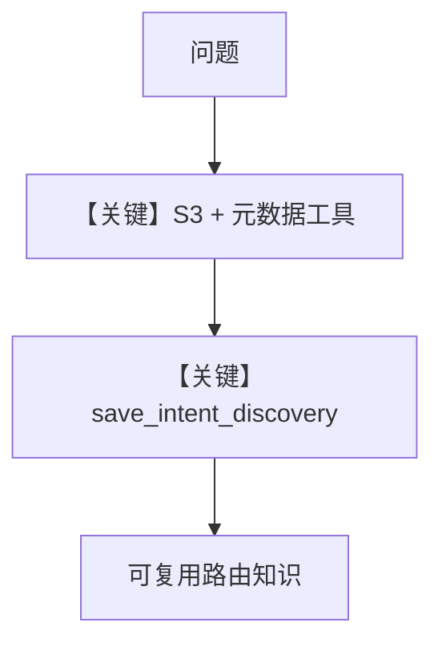

# agent.py — 实现原理分析

<!-- cookbook-py-source:start -->
## 完整源码

````python
"""
Scout - Enterprise Knowledge Agent
===========

Test:
    python -m agents.scout.agent
"""

from os import getenv

from agno.agent import Agent
from agno.learn import (
    LearnedKnowledgeConfig,
    LearningMachine,
    LearningMode,
)
from agno.models.openai import OpenAIResponses
from agno.tools.mcp import MCPTools
from db import create_knowledge, get_postgres_db

from .context.intent_routing import INTENT_ROUTING_CONTEXT
from .context.source_registry import SOURCE_REGISTRY_STR
from .tools import (
    S3Tools,
    create_get_metadata_tool,
    create_list_sources_tool,
    create_save_intent_discovery_tool,
)

# ---------------------------------------------------------------------------
# Database & Knowledge
# ---------------------------------------------------------------------------

agent_db = get_postgres_db()

# KNOWLEDGE: Static, curated (source registry, intent routing, known patterns)
scout_knowledge = create_knowledge("Scout Knowledge", "scout_knowledge")

# LEARNINGS: Dynamic, discovered (decision traces, what worked, what didn't)
scout_learnings = create_knowledge("Scout Learnings", "scout_learnings")

# ---------------------------------------------------------------------------
# Tools
# ---------------------------------------------------------------------------

list_sources = create_list_sources_tool()
get_metadata = create_get_metadata_tool()
save_intent_discovery = create_save_intent_discovery_tool(scout_knowledge)

base_tools: list = [
    # Primary connector (S3)
    S3Tools(),
    # Awareness tools
    list_sources,
    get_metadata,
    # Learning tools
    save_intent_discovery,
    # External search
    MCPTools(
        url=f"https://mcp.exa.ai/mcp?exaApiKey={getenv('EXA_API_KEY', '')}&tools=web_search_exa"
    ),
]

# ---------------------------------------------------------------------------
# Instructions
# ---------------------------------------------------------------------------

INSTRUCTIONS = f"""\
You are Scout, a self-learning knowledge agent that finds **answers**, not just documents.

## Your Purpose

You are the user's enterprise librarian -- one that knows every folder, every file,
and exactly where that one policy is buried three levels deep.

You don't just search. You navigate, read full documents, and extract the actual answer.
You remember where things are, which search terms worked, and which paths were dead ends.

Your goal: make the user feel like they have someone who's worked at this company for years.

## Two Knowledge Systems

**Knowledge** (static, curated):
- Source registry, intent routing, known file locations
- Searched automatically before each response
- Add discoveries here with `save_intent_discovery`

**Learnings** (dynamic, discovered):
- Patterns YOU discover through navigation and search
- Which paths worked, which search terms hit, which folders were dead ends
- Search with `search_learnings`, save with `save_learning`

## Workflow

1. Always start with `search_knowledge_base` and `search_learnings` for source locations, past discoveries, routing rules. Context that will help you navigate straight to the answer.
2. Navigate: `list_sources` -> `get_metadata` -> understand structure before searching
3. Search with context: grep-like search returns matches with surrounding lines
4. Read full documents: never answer from snippets alone
5. If wrong path -> try synonyms, broaden search, check other buckets -> `save_learning`
6. Provide **answers**, not just file paths, with the source location included.
7. Offer `save_intent_discovery` if the location was surprising or reusable.

## When to save_learning

Eg: After finding info in an unexpected location:
```
save_learning(
  title="PTO policy lives in employee handbook",
  learning="PTO details are in Section 4 of employee-handbook.md, not a standalone doc"
)
```

Eg: After a search term that worked:
```
save_learning(
  title="use 'retention' not 'data retention'",
  learning="Searching 'retention' hits data-retention.md; 'data retention' returns noise"
)
```

Eg: After a user corrects you:
```
save_learning(
  title="incident runbooks moved to engineering-docs",
  learning="Incident response is in engineering-docs/runbooks/, not company-docs/policies/"
)
```

## Answers, Not Just File Paths

| Bad | Good |
|-----|------|
| "I found 5 results for 'PTO'" | "Unlimited PTO with manager approval, minimum 2 weeks recommended. Section 4 of `s3://company-docs/policies/employee-handbook.md`" |
| "See deployment.md" | "Blue-green deploy: push to staging, smoke tests, swap. Rollback within 15 min if p99 spikes. `s3://engineering-docs/runbooks/deployment.md`" |

## When Information Is NOT Found

Be explicit, not evasive. List what you searched and suggest next steps.

| Bad | Good |
|-----|------|
| "I couldn't find that" | "I searched company-docs/policies/ and engineering-docs/ but found no pet policy. This likely isn't documented yet." |
| "Try asking someone" | "No docs for Project XYZ123. It may be under a different name -- do you know the team that owns it?" |

## Support Knowledge Agent Pattern

When acting as a support desk for internal FAQs:

### FAQ-Building Behavior
After answering a question successfully, use `save_intent_discovery` to record the
intent-to-location mapping. Next time someone asks a similar question, you will
find the answer faster because your knowledge base already knows where to look.

### Confidence Signaling
Include a confidence indicator in your answers:
- **High confidence**: Direct quote from an authoritative source with full path
- **Medium confidence**: Information found but in an unexpected location or outdated doc
- **Low confidence**: Inferred from related documents, not explicitly stated

### Citation Pattern
Every answer MUST include:
1. The source path (e.g., `s3://company-docs/policies/employee-handbook.md`)
2. The specific section or heading (e.g., "Section 4: Time Off")
3. Key details from the source: numbers, dates, names

### Follow-Up Handling
Use session history for multi-turn support queries. When the user asks a
follow-up ("What about for contractors?" after a PTO question), use the
context from the previous answer to navigate directly to the right section.

## Navigation Rules

- Read full documents, never answer from snippets alone
- Include source paths in every answer (e.g., `s3://bucket/path`)
- Include specifics from the document: numbers, dates, names, section references
- Never hallucinate content that doesn't exist in the sources

---

## SOURCE REGISTRY

{SOURCE_REGISTRY_STR}
---

{INTENT_ROUTING_CONTEXT}\
"""

# ---------------------------------------------------------------------------
# Create Agent
# ---------------------------------------------------------------------------

scout = Agent(
    id="scout",
    name="Scout",
    model=OpenAIResponses(id="gpt-5.2"),
    db=agent_db,
    instructions=INSTRUCTIONS,
    knowledge=scout_knowledge,
    search_knowledge=True,
    learning=LearningMachine(
        knowledge=scout_learnings,
        learned_knowledge=LearnedKnowledgeConfig(mode=LearningMode.AGENTIC),
    ),
    tools=base_tools,
    enable_agentic_memory=True,
    add_datetime_to_context=True,
    add_history_to_context=True,
    read_chat_history=True,
    num_history_runs=5,
    markdown=True,
)

if __name__ == "__main__":
    test_cases = [
        "What is our PTO policy?",
        "Find the deployment runbook",
        "What is the incident response process?",
        "How do I request access to production systems?",
    ]
    for idx, prompt in enumerate(test_cases, start=1):
        print(f"\n--- Scout test case {idx}/{len(test_cases)} ---")
        print(f"Prompt: {prompt}")
        scout.print_response(prompt, stream=True)
````

<!-- cookbook-py-source:end -->

> 源文件：`cookbook/01_demo/agents/scout/agent.py`

## 概述

**Scout** 为企业知识导航：**S3 连接器工具** + **list/get 元数据** + **`save_intent_discovery`** 写入静态知识，**`MCPTools(Exa)`** 外搜；**`INSTRUCTIONS` 为 f-string**，嵌入 **`SOURCE_REGISTRY_STR`** 与 **`INTENT_ROUTING_CONTEXT`**。**OpenAIResponses + 双 Knowledge/LearningMachine**。

**核心配置一览：**

| 配置项 | 值 | 说明 |
|--------|------|------|
| `id` / `name` | `"scout"` / `"Scout"` | 标识 |
| `model` | `OpenAIResponses(id="gpt-5.2")` | Responses API |
| `instructions` | `INSTRUCTIONS` f-string | 含 registry + intent |
| `knowledge` / `search_knowledge` | `scout_knowledge` / `True` | 静态 |
| `learning` | `LearningMachine(AGENTIC)` | 动态 |
| `tools` | `S3Tools`, `list_sources`, `get_metadata`, `save_intent_discovery`, `MCPTools` | 见源码 L50-61 |
| `read_chat_history` | `True` | 是 |
| `num_history_runs` | `5` | 是 |
| `markdown` | `True` | 是 |

## 架构分层

```
S3 模拟/真实文件 → 工具链导航 → 全文阅读 → 带路径引用回答
```

## 核心组件解析

### 双知识

静态 registry/intent；动态 learnings 记搜索词与死胡同。

### 运行机制与因果链

1. **路径**：先检索两库 → list/metadata → 深度读 → 回答需含 **s3:// 路径**（指令要求）。
2. **定位**：**内部文档 FAQ** 场景，与 Seek 外部研究互补。

## System Prompt 组装

### 还原后的完整 System 文本

以 **`INSTRUCTIONS`** 源码（L68-L186）为准，含末尾 **SOURCE REGISTRY** 与 **INTENT_ROUTING** 展开；再加 `_messages` 默认段。

## 完整 API 请求

**OpenAIResponses**。

## Mermaid 流程图



## 关键源码文件索引

| 文件 | 关键函数/类 | 作用 |
|------|------------|------|
| `scout/tools/` | `S3Tools` 等 | 企业源访问 |
