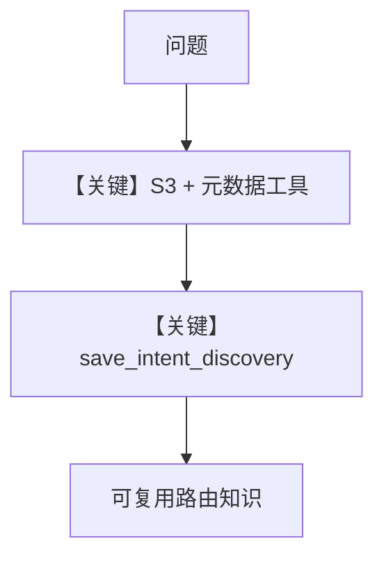

# agent.py — 实现原理分析

> 源文件：`cookbook/01_demo/agents/scout/agent.py`

## 概述

**Scout** 为企业知识导航：**S3 连接器工具** + **list/get 元数据** + **`save_intent_discovery`** 写入静态知识，**`MCPTools(Exa)`** 外搜；**`INSTRUCTIONS` 为 f-string**，嵌入 **`SOURCE_REGISTRY_STR`** 与 **`INTENT_ROUTING_CONTEXT`**。**OpenAIResponses + 双 Knowledge/LearningMachine**。

**核心配置一览：**

| 配置项 | 值 | 说明 |
|--------|------|------|
| `id` / `name` | `"scout"` / `"Scout"` | 标识 |
| `model` | `OpenAIResponses(id="gpt-5.2")` | Responses API |
| `instructions` | `INSTRUCTIONS` f-string | 含 registry + intent |
| `knowledge` / `search_knowledge` | `scout_knowledge` / `True` | 静态 |
| `learning` | `LearningMachine(AGENTIC)` | 动态 |
| `tools` | `S3Tools`, `list_sources`, `get_metadata`, `save_intent_discovery`, `MCPTools` | 见源码 L50-61 |
| `read_chat_history` | `True` | 是 |
| `num_history_runs` | `5` | 是 |
| `markdown` | `True` | 是 |

## 架构分层

```
S3 模拟/真实文件 → 工具链导航 → 全文阅读 → 带路径引用回答
```

## 核心组件解析

### 双知识

静态 registry/intent；动态 learnings 记搜索词与死胡同。

### 运行机制与因果链

1. **路径**：先检索两库 → list/metadata → 深度读 → 回答需含 **s3:// 路径**（指令要求）。
2. **定位**：**内部文档 FAQ** 场景，与 Seek 外部研究互补。

## System Prompt 组装

### 还原后的完整 System 文本

以 **`INSTRUCTIONS`** 源码（L68-L186）为准，含末尾 **SOURCE REGISTRY** 与 **INTENT_ROUTING** 展开；再加 `_messages` 默认段。

## 完整 API 请求

**OpenAIResponses**。

## Mermaid 流程图



## 关键源码文件索引

| 文件 | 关键函数/类 | 作用 |
|------|------------|------|
| `scout/tools/` | `S3Tools` 等 | 企业源访问 |
