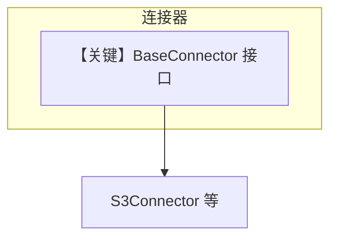

# base.py — 实现原理分析

> 源文件：`cookbook/01_demo/agents/scout/connectors/base.py`

## 概述

定义 **`BaseConnector`** 抽象基类：约束各知识源连接器需实现 **`source_type`**、**`source_name`**、**`authenticate`**、**`list_items`**、**`search`** 等，用于统一 **S3/Google Drive/…** 等多后端接口。**无 Agent**。

**核心配置一览：** ABC，无 Agent 参数。

## 架构分层

```
具体连接器 (如 S3Connector) → 实现 BaseConnector → Scout 工具层调用
```

## 核心组件解析

面向对象边界：工具不直接依赖 S3 细节，而依赖连接器接口（`base.py` L7+）。

### 运行机制与因果链

纯类型契约；运行时装配在 `S3Connector` 等子类。

## System Prompt 组装

不适用。

## 完整 API 请求

不适用（连接器可能内部调云 API，不在本文件发起 LLM）。

## Mermaid 流程图



## 关键源码文件索引

| 文件 | 关键函数/类 | 作用 |
|------|------------|------|
| `base.py` | `BaseConnector` L7 | 抽象接口 |
