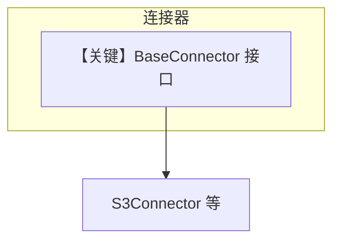

# base.py — 实现原理分析

<!-- cookbook-py-source:start -->
## 完整源码

```python
"""Base connector interface for all knowledge sources."""

from abc import ABC, abstractmethod
from typing import Any


class BaseConnector(ABC):
    """Abstract base class for all knowledge source connectors."""

    @property
    @abstractmethod
    def source_type(self) -> str:
        """Return the source type identifier (e.g., 'google_drive', 'notion', 'slack')."""

    @property
    @abstractmethod
    def source_name(self) -> str:
        """Return the human-readable source name."""

    @abstractmethod
    def authenticate(self) -> bool:
        """
        Authenticate with the source.

        Returns:
            True if authentication successful, False otherwise.
        """

    @abstractmethod
    def list_items(
        self,
        parent_id: str | None = None,
        item_type: str | None = None,
        limit: int = 50,
    ) -> list[dict[str, Any]]:
        """
        List items in the source.

        Args:
            parent_id: Parent container ID (folder, workspace, channel)
            item_type: Filter by item type
            limit: Maximum items to return

        Returns:
            List of item dictionaries with at minimum 'id', 'name', 'type' fields.
        """

    @abstractmethod
    def search(
        self,
        query: str,
        filters: dict[str, Any] | None = None,
        limit: int = 20,
    ) -> list[dict[str, Any]]:
        """
        Search for content in the source.

        Args:
            query: Search query string
            filters: Optional filters (e.g., file type, date range, author)
            limit: Maximum results to return

        Returns:
            List of search result dictionaries.
        """

    @abstractmethod
    def read(
        self,
        item_id: str,
        options: dict[str, Any] | None = None,
    ) -> dict[str, Any]:
        """
        Read content from a specific item.

        Args:
            item_id: The item identifier
            options: Optional read options (e.g., page range, include_metadata)

        Returns:
            Dictionary with 'content', 'metadata', and source-specific fields.
        """

    @abstractmethod
    def write(
        self,
        parent_id: str,
        title: str,
        content: str,
        options: dict[str, Any] | None = None,
    ) -> dict[str, Any]:
        """
        Create new content in the source.

        Args:
            parent_id: Parent container ID
            title: Title/name for the new content
            content: The content to write
            options: Optional write options

        Returns:
            Dictionary with created item info including 'id'.
        """

    @abstractmethod
    def update(
        self,
        item_id: str,
        content: str | None = None,
        properties: dict[str, Any] | None = None,
    ) -> dict[str, Any]:
        """
        Update existing content.

        Args:
            item_id: The item to update
            content: New content (if updating content)
            properties: Properties to update (e.g., title, metadata)

        Returns:
            Dictionary with updated item info.
        """
```

<!-- cookbook-py-source:end -->

> 源文件：`cookbook/01_demo/agents/scout/connectors/base.py`

## 概述

定义 **`BaseConnector`** 抽象基类：约束各知识源连接器需实现 **`source_type`**、**`source_name`**、**`authenticate`**、**`list_items`**、**`search`** 等，用于统一 **S3/Google Drive/…** 等多后端接口。**无 Agent**。

**核心配置一览：** ABC，无 Agent 参数。

## 架构分层

```
具体连接器 (如 S3Connector) → 实现 BaseConnector → Scout 工具层调用
```

## 核心组件解析

面向对象边界：工具不直接依赖 S3 细节，而依赖连接器接口（`base.py` L7+）。

### 运行机制与因果链

纯类型契约；运行时装配在 `S3Connector` 等子类。

## System Prompt 组装

不适用。

## 完整 API 请求

不适用（连接器可能内部调云 API，不在本文件发起 LLM）。

## Mermaid 流程图



## 关键源码文件索引

| 文件 | 关键函数/类 | 作用 |
|------|------------|------|
| `base.py` | `BaseConnector` L7 | 抽象接口 |
