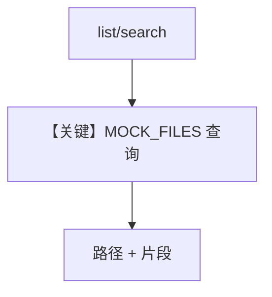

# s3.py — 实现原理分析

> 源文件：`cookbook/01_demo/agents/scout/connectors/s3.py`

## 概述

**`S3Connector`** 的 **stub 实现**：用 **`MOCK_BUCKETS`**、**`MOCK_FILES`** 等内存数据模拟企业 S3 布局，供 demo **无需真实 AWS** 即可演练 list/read/search。实现 **`BaseConnector`** 契约。

**核心配置一览：** 无 Agent。

## 架构分层

```
工具 S3Tools → S3Connector → 返回 mock 路径与内容
```

## 核心组件解析

大文件内含模拟桶、对象键、可检索正文；**生产可替换为真实 boto3**（本仓库为教学 stub）。

### 运行机制与因果链

1. **路径**：工具调用 → connector → 字符串/Markdown 结果 → 模型。
2. **副作用**：无持久化（纯 mock）。

## System Prompt 组装

不适用；**source registry** 在 `source_registry.py` 与 agent instructions 中描述桶名。

## 完整 API 请求

无 LLM；若接真 S3 则为 AWS SDK。

## Mermaid 流程图



## 关键源码文件索引

| 文件 | 关键函数/类 | 作用 |
|------|------------|------|
| `s3.py` | `S3Connector` | Demo 数据源 |
