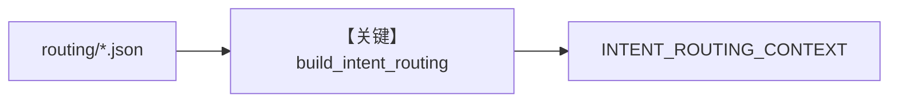

# intent_routing.py — 实现原理分析

> 源文件：`cookbook/01_demo/agents/scout/context/intent_routing.py`

## 概述

从 **`knowledge/routing/*.json`** 加载 **intent 映射、源偏好、常见坑**，**`build_intent_routing`** 格式化为字符串 **`INTENT_ROUTING_CONTEXT`**，嵌入 **`scout/agent.py`** 的 **`INSTRUCTIONS` f-string**（`---` 后 `{INTENT_ROUTING_CONTEXT}`）。

**核心配置一览：** 无 Agent。

## 架构分层

```
ROUTING_DIR/*.json → load_intent_rules → build_intent_routing → Scout instructions
```

## 核心组件解析

见 `build_intent_routing`（`intent_routing.py` L39+）：将结构化规则渲染为 Markdown 供模型遵循。

### 运行机制与因果链

静态 import 时拼入 instructions；改 JSON 需重启进程生效。

## System Prompt 组装

作为 **instructions 子串**，影响 **意图→路径** 的 prior。

### 还原后的完整 System 文本

取决于 `knowledge/routing` 下 JSON；空目录时规则对象各列表为空（`L17-L21`）。

## 完整 API 请求

无。

## Mermaid 流程图



## 关键源码文件索引

| 文件 | 关键函数/类 | 作用 |
|------|------------|------|
| `intent_routing.py` | `build_intent_routing` L39 | 路由上下文 |
