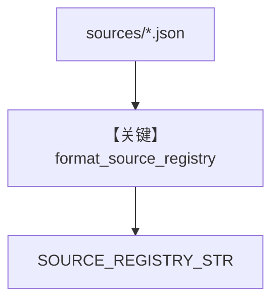

# source_registry.py — 实现原理分析

<!-- cookbook-py-source:start -->
## 完整源码

```python
"""Load source metadata for the system prompt."""

import json
from pathlib import Path
from typing import Any

from agno.utils.log import logger

from ..paths import SOURCES_DIR


def load_source_metadata(sources_dir: Path | None = None) -> list[dict[str, Any]]:
    """Load source metadata from JSON files."""
    if sources_dir is None:
        sources_dir = SOURCES_DIR

    sources: list[dict[str, Any]] = []
    if not sources_dir.exists():
        return sources

    for filepath in sorted(sources_dir.glob("*.json")):
        try:
            with open(filepath) as f:
                source = json.load(f)
            sources.append(
                {
                    "source_name": source["source_name"],
                    "source_type": source["source_type"],
                    "description": source.get("description", ""),
                    "content_types": source.get("content_types", []),
                    "capabilities": source.get("capabilities", []),
                    "limitations": source.get("limitations", []),
                    "common_locations": source.get("common_locations", {}),
                    "search_tips": source.get("search_tips", []),
                    "buckets": source.get("buckets", []),  # S3-specific
                }
            )
        except (json.JSONDecodeError, KeyError, OSError) as e:
            logger.error(f"Failed to load {filepath}: {e}")

    return sources


def build_source_registry(sources_dir: Path | None = None) -> dict[str, Any]:
    """Build source registry from source metadata."""
    sources = load_source_metadata(sources_dir)
    return {
        "sources": sources,
        "source_types": [s["source_type"] for s in sources],
    }


def format_source_registry(registry: dict[str, Any]) -> str:
    """Format source registry for system prompt."""
    lines: list[str] = []

    for source in registry.get("sources", []):
        lines.append(f"### {source['source_name']} (`{source['source_type']}`)")
        if source.get("description"):
            lines.append(source["description"])
        lines.append("")

        # For S3, show buckets prominently
        if source["source_type"] == "s3" and source.get("buckets"):
            lines.append("**Buckets:**")
            for bucket in source["buckets"]:
                lines.append(f"- `{bucket['name']}`: {bucket.get('description', '')}")
                if bucket.get("contains"):
                    lines.append(f"  Contains: {', '.join(bucket['contains'])}")
            lines.append("")

        if source.get("common_locations"):
            lines.append("**Known locations:**")
            for key, value in list(source["common_locations"].items()):
                lines.append(f"- {key}: `{value}`")
            lines.append("")

        if source.get("capabilities"):
            lines.append("**Capabilities:** " + ", ".join(source["capabilities"][:4]))
            lines.append("")

        if source.get("search_tips"):
            lines.append("**Tips:** " + " | ".join(source["search_tips"][:2]))
            lines.append("")

        lines.append("")

    return "\n".join(lines)


SOURCE_REGISTRY = build_source_registry()
SOURCE_REGISTRY_STR = format_source_registry(SOURCE_REGISTRY)
```

<!-- cookbook-py-source:end -->

> 源文件：`cookbook/01_demo/agents/scout/context/source_registry.py`

## 概述

从 **`knowledge/sources/*.json`** 加载 **源名称、类型、能力、桶、搜索技巧**，**`format_source_registry`** 生成 **`SOURCE_REGISTRY_STR`**，并构建 **`SOURCE_REGISTRY`** 字典供 **`awareness.py`** 列出源。嵌入 **Scout `INSTRUCTIONS`** 中 **`## SOURCE REGISTRY`** 段。

**核心配置一览：** 无 Agent。

## 架构分层

```
sources/*.json → load_source_metadata → SOURCE_REGISTRY_STR + SOURCE_REGISTRY
```

## 核心组件解析

`SOURCE_REGISTRY` 被 **`list_sources`** 等工具读取（`awareness.py` L33）。

### 运行机制与因果链

与 intent 类似：**静态嵌入 + 工具侧读取** 双用。

## System Prompt 组装

### 还原后的完整 System 文本

见 `agent.py` 中 `## SOURCE REGISTRY` 占位展开；JSON 内容决定正文。

## 完整 API 请求

无。

## Mermaid 流程图



## 关键源码文件索引

| 文件 | 关键函数/类 | 作用 |
|------|------------|------|
| `source_registry.py` | `load_source_metadata` L12 | 源清单 |
