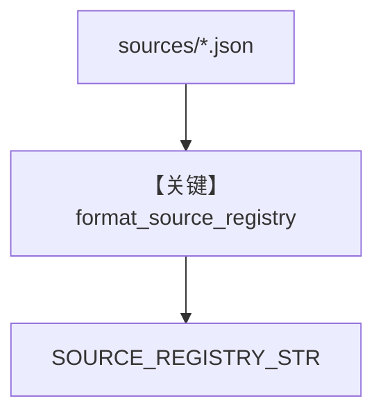

# source_registry.py — 实现原理分析

> 源文件：`cookbook/01_demo/agents/scout/context/source_registry.py`

## 概述

从 **`knowledge/sources/*.json`** 加载 **源名称、类型、能力、桶、搜索技巧**，**`format_source_registry`** 生成 **`SOURCE_REGISTRY_STR`**，并构建 **`SOURCE_REGISTRY`** 字典供 **`awareness.py`** 列出源。嵌入 **Scout `INSTRUCTIONS`** 中 **`## SOURCE REGISTRY`** 段。

**核心配置一览：** 无 Agent。

## 架构分层

```
sources/*.json → load_source_metadata → SOURCE_REGISTRY_STR + SOURCE_REGISTRY
```

## 核心组件解析

`SOURCE_REGISTRY` 被 **`list_sources`** 等工具读取（`awareness.py` L33）。

### 运行机制与因果链

与 intent 类似：**静态嵌入 + 工具侧读取** 双用。

## System Prompt 组装

### 还原后的完整 System 文本

见 `agent.py` 中 `## SOURCE REGISTRY` 占位展开；JSON 内容决定正文。

## 完整 API 请求

无。

## Mermaid 流程图



## 关键源码文件索引

| 文件 | 关键函数/类 | 作用 |
|------|------------|------|
| `source_registry.py` | `load_source_metadata` L12 | 源清单 |
