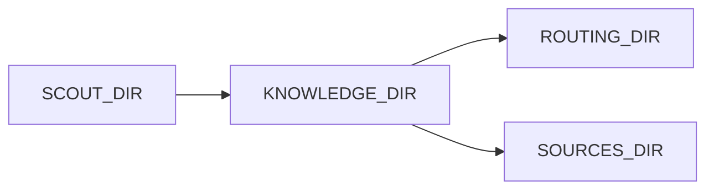

# paths.py — 实现原理分析

<!-- cookbook-py-source:start -->
## 完整源码

```python
"""Path constants."""

from pathlib import Path

SCOUT_DIR = Path(__file__).parent
KNOWLEDGE_DIR = SCOUT_DIR / "knowledge"
SOURCES_DIR = KNOWLEDGE_DIR / "sources"
ROUTING_DIR = KNOWLEDGE_DIR / "routing"
PATTERNS_DIR = KNOWLEDGE_DIR / "patterns"
```

<!-- cookbook-py-source:end -->

> 源文件：`cookbook/01_demo/agents/scout/paths.py`

## 概述

定义 **Scout** 知识目录常量：**`KNOWLEDGE_DIR`、`SOURCES_DIR`、`ROUTING_DIR`、`PATTERNS_DIR`**，供 `context/*.py` 与加载脚本使用。**无 Agent**。

## 架构分层

```
SCOUT_DIR → 子路径常量
```

## 核心组件解析

与 Dash `paths` 同理，集中维护。

## System Prompt 组装

不适用。

## 完整 API 请求

不适用。

## Mermaid 流程图



## 关键源码文件索引

| 文件 | 关键函数/类 | 作用 |
|------|------------|------|
| `paths.py` | 各 `Path` | 目录常量 |
