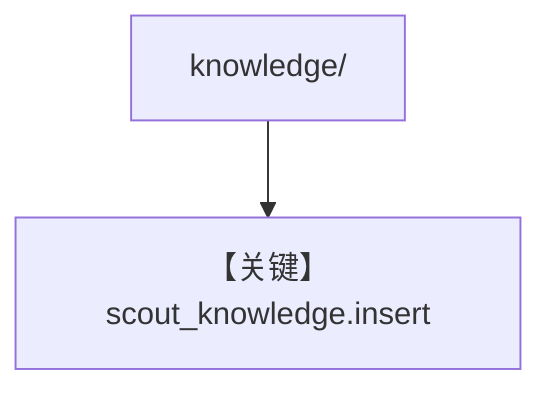

# load_knowledge.py — 实现原理分析

> 源文件：`cookbook/01_demo/agents/scout/scripts/load_knowledge.py`

## 概述

将 **`knowledge/sources`、`routing`、`patterns`** 目录批量 **`insert`** 到 **`scout_knowledge`** 向量库（需从 **`..agent` 导入 `scout_knowledge`**）。**`--recreate`** 可选重建向量表。供 **search_knowledge** 命中，与 **f-string 静态段** 互补。

**核心配置一览：** 无 Agent 构造。

## 架构分层

```
子目录 iterate → scout_knowledge.insert(name, path)
```

## 核心组件解析

典型批量入库脚本；与 Dash `load_knowledge` 结构类似，目录名不同。

### 运行机制与因果链

**副作用**：写入 PgVector；**import agent** 会执行 Scout 模块顶层（注意副作用）。

## System Prompt 组装

不适用脚本本身；入库影响检索命中。

## 完整 API 请求

无 LLM。

## Mermaid 流程图



## 关键源码文件索引

| 文件 | 关键函数/类 | 作用 |
|------|------------|------|
| `scout/agent.py` | `scout_knowledge` | 向量库实例 |
