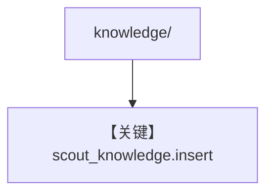

# load_knowledge.py — 实现原理分析

<!-- cookbook-py-source:start -->
## 完整源码

```python
"""
Load Knowledge - Loads source metadata, routing rules, and patterns into knowledge base.

Usage:
    python -m agents.scout.scripts.load_knowledge
    python -m agents.scout.scripts.load_knowledge --recreate
"""

import argparse

from ..paths import KNOWLEDGE_DIR

if __name__ == "__main__":
    parser = argparse.ArgumentParser(description="Load knowledge into vector database")
    parser.add_argument(
        "--recreate",
        action="store_true",
        help="Drop existing knowledge and reload from scratch",
    )
    args = parser.parse_args()

    from ..agent import scout_knowledge

    if args.recreate:
        print("Recreating knowledge base (dropping existing data)...\n")
        if scout_knowledge.vector_db:
            scout_knowledge.vector_db.drop()
            scout_knowledge.vector_db.create()

    print(f"Loading knowledge from: {KNOWLEDGE_DIR}\n")

    for subdir in ["sources", "routing", "patterns"]:
        path = KNOWLEDGE_DIR / subdir
        if not path.exists():
            print(f"  {subdir}/: (not found)")
            continue

        files = [
            f for f in path.iterdir() if f.is_file() and not f.name.startswith(".")
        ]
        print(f"  {subdir}/: {len(files)} files")

        if files:
            scout_knowledge.insert(name=f"knowledge-{subdir}", path=str(path))

    print("\nDone!")
```

<!-- cookbook-py-source:end -->

> 源文件：`cookbook/01_demo/agents/scout/scripts/load_knowledge.py`

## 概述

将 **`knowledge/sources`、`routing`、`patterns`** 目录批量 **`insert`** 到 **`scout_knowledge`** 向量库（需从 **`..agent` 导入 `scout_knowledge`**）。**`--recreate`** 可选重建向量表。供 **search_knowledge** 命中，与 **f-string 静态段** 互补。

**核心配置一览：** 无 Agent 构造。

## 架构分层

```
子目录 iterate → scout_knowledge.insert(name, path)
```

## 核心组件解析

典型批量入库脚本；与 Dash `load_knowledge` 结构类似，目录名不同。

### 运行机制与因果链

**副作用**：写入 PgVector；**import agent** 会执行 Scout 模块顶层（注意副作用）。

## System Prompt 组装

不适用脚本本身；入库影响检索命中。

## 完整 API 请求

无 LLM。

## Mermaid 流程图



## 关键源码文件索引

| 文件 | 关键函数/类 | 作用 |
|------|------------|------|
| `scout/agent.py` | `scout_knowledge` | 向量库实例 |
