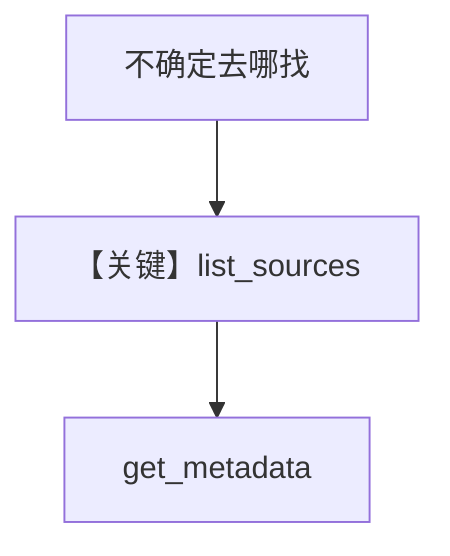

# awareness.py — 实现原理分析

<!-- cookbook-py-source:start -->
## 完整源码

```python
"""Awareness tools for discovering available sources and metadata.

These tools mirror Claude Code's approach: know what exists, understand structure,
before diving into search.
"""

from agno.tools import tool

from ..connectors import S3Connector
from ..context.source_registry import SOURCE_REGISTRY


def create_list_sources_tool():
    """Create list_sources tool."""

    @tool
    def list_sources(
        source_type: str | None = None,
        include_details: bool = False,
    ) -> str:
        """List available knowledge sources.

        Use this to understand what sources are connected and what they contain.
        Always start here if you're unsure where to look.

        Args:
            source_type: Filter to specific source type (s3).
                        If None, lists all sources.
            include_details: Include detailed info about each source's contents.
        """
        lines: list[str] = ["## Available Sources", ""]

        sources = SOURCE_REGISTRY.get("sources", [])

        if source_type:
            sources = [s for s in sources if s["source_type"] == source_type]

        if not sources:
            return (
                f"No sources found for type: {source_type}"
                if source_type
                else "No sources configured."
            )

        for source in sources:
            lines.append(f"### {source['source_name']} (`{source['source_type']}`)")
            if source.get("description"):
                lines.append(source["description"])
            lines.append("")

            if include_details:
                if source.get("capabilities"):
                    lines.append("**Capabilities:**")
                    for cap in source["capabilities"][:5]:
                        lines.append(f"  - {cap}")
                    lines.append("")

                if source.get("common_locations"):
                    lines.append("**Where to find things:**")
                    for key, value in list(source["common_locations"].items())[:6]:
                        lines.append(f"  - {key}: `{value}`")
                    lines.append("")

                # For S3, list buckets
                if source["source_type"] == "s3" and source.get("buckets"):
                    lines.append("**Buckets:**")
                    for bucket in source["buckets"]:
                        lines.append(
                            f"  - **{bucket['name']}**: {bucket.get('description', '')}"
                        )
                    lines.append("")

            lines.append("")

        return "\n".join(lines)

    return list_sources


def create_get_metadata_tool():
    """Create get_metadata tool."""
    connectors = {
        "s3": S3Connector(),
    }

    @tool
    def get_metadata(
        source: str,
        path: str | None = None,
    ) -> str:
        """Get metadata about a source or specific path without reading content.

        Use this to understand structure before searching or reading.
        For S3: lists buckets, folders, or file metadata.

        Args:
            source: Source type (s3).
            path: Optional path to inspect. Format depends on source:
                  - S3: "bucket-name" or "bucket-name/prefix"
        """
        if source not in connectors:
            return (
                f"Unknown source: {source}. Available: {', '.join(connectors.keys())}"
            )

        connector = connectors[source]
        connector.authenticate()

        if not path:
            # List top-level items
            items = connector.list_items(limit=30)

            if not items:
                return f"No items found in {source}."

            lines = [f"## {connector.source_name} Structure", ""]

            for item in items:
                icon = _get_icon(item.get("type", ""), source)
                name = item.get("name", item.get("id", "Unknown"))

                if item.get("type") in (
                    "bucket",
                    "folder",
                    "directory",
                    "page",
                    "database",
                ):
                    lines.append(f"{icon} **{name}/**")
                else:
                    size_info = ""
                    if item.get("size"):
                        size_info = f" ({_format_size(item['size'])})"
                    lines.append(f"{icon} {name}{size_info}")

                if item.get("id") and item["id"] != name:
                    lines.append(f"   `{item['id']}`")

            return "\n".join(lines)

        # Get specific path metadata
        items = connector.list_items(parent_id=path, limit=30)

        if not items:
            # Try reading as a file
            result = connector.read(path)
            if "error" not in result:
                lines = [f"## File: {path}", ""]
                if result.get("metadata"):
                    meta = result["metadata"]
                    for key, value in meta.items():
                        lines.append(f"**{key}:** {value}")
                return "\n".join(lines)
            return f"Path not found or empty: {path}"

        lines = [f"## Contents of {path}", ""]

        for item in items:
            icon = _get_icon(item.get("type", ""), source)
            name = item.get("name", item.get("id", "Unknown"))

            if item.get("type") in (
                "bucket",
                "folder",
                "directory",
                "page",
                "database",
            ):
                lines.append(f"{icon} **{name}/**")
            else:
                size_info = ""
                if item.get("size"):
                    size_info = f" ({_format_size(item['size'])})"
                modified = item.get("modified", "")
                if modified:
                    size_info += f" - {modified}"
                lines.append(f"{icon} {name}{size_info}")

        return "\n".join(lines)

    return get_metadata


def _get_icon(item_type: str, source: str = "") -> str:
    """Get an icon for the item type."""
    icons = {
        "bucket": "[bucket]",
        "folder": "[dir]",
        "directory": "[dir]",
        "file": "[file]",
        "document": "[doc]",
        "spreadsheet": "[sheet]",
        "page": "[page]",
        "database": "[db]",
    }
    return icons.get(item_type, "[item]")


def _format_size(size: int) -> str:
    """Format file size in human-readable format."""
    if size < 1024:
        return f"{size} B"
    elif size < 1024 * 1024:
        return f"{size / 1024:.1f} KB"
    else:
        return f"{size / (1024 * 1024):.1f} MB"
```

<!-- cookbook-py-source:end -->

> 源文件：`cookbook/01_demo/agents/scout/tools/awareness.py`

## 概述

**`create_list_sources_tool` / `create_get_metadata_tool`** 返回 **`list_sources`** 与 **`get_metadata`**：先从内存 **`SOURCE_REGISTRY`** 展示可用源与结构，再经 **`S3Connector`** 取桶/对象细节，体现 **「先感知再搜索」**。注册进 **Scout `base_tools`**。

**核心配置一览：** 工厂函数，无 Agent。

## 架构分层

```
模型 → list_sources → SOURCE_REGISTRY 文本
     → get_metadata → S3Connector mock 元数据
```

## 核心组件解析

Docstring 强调 **Always start here**（`awareness.py` L1-L5 模块注释）。

### 运行机制与因果链

只读；返回 Markdown 字符串供模型规划搜索。

## System Prompt 组装

工具 schema 来自 **@tool**；与 **instructions** 中「先 list_sources」一致。

## 完整 API 请求

无 LLM；结果回灌 Responses 消息序列。

## Mermaid 流程图



## 关键源码文件索引

| 文件 | 关键函数/类 | 作用 |
|------|------------|------|
| `awareness.py` | `create_list_sources_tool` L13 | 源发现 |
