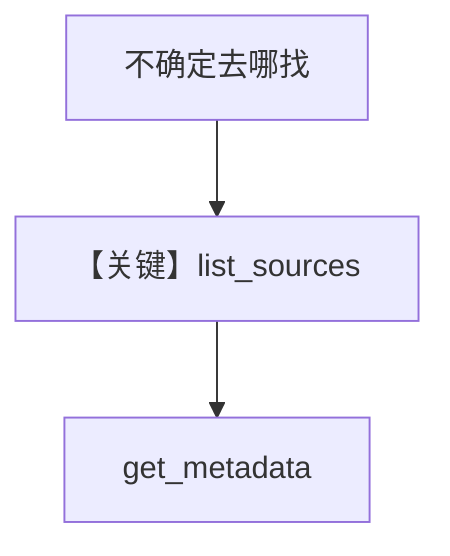

# awareness.py — 实现原理分析

> 源文件：`cookbook/01_demo/agents/scout/tools/awareness.py`

## 概述

**`create_list_sources_tool` / `create_get_metadata_tool`** 返回 **`list_sources`** 与 **`get_metadata`**：先从内存 **`SOURCE_REGISTRY`** 展示可用源与结构，再经 **`S3Connector`** 取桶/对象细节，体现 **「先感知再搜索」**。注册进 **Scout `base_tools`**。

**核心配置一览：** 工厂函数，无 Agent。

## 架构分层

```
模型 → list_sources → SOURCE_REGISTRY 文本
     → get_metadata → S3Connector mock 元数据
```

## 核心组件解析

Docstring 强调 **Always start here**（`awareness.py` L1-L5 模块注释）。

### 运行机制与因果链

只读；返回 Markdown 字符串供模型规划搜索。

## System Prompt 组装

工具 schema 来自 **@tool**；与 **instructions** 中「先 list_sources」一致。

## 完整 API 请求

无 LLM；结果回灌 Responses 消息序列。

## Mermaid 流程图



## 关键源码文件索引

| 文件 | 关键函数/类 | 作用 |
|------|------------|------|
| `awareness.py` | `create_list_sources_tool` L13 | 源发现 |
