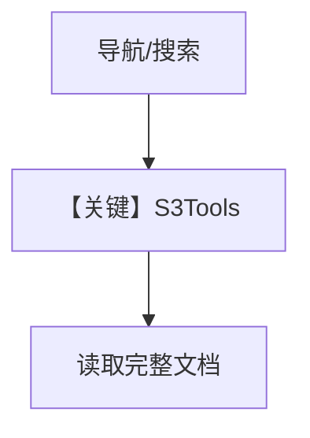

# s3.py — 实现原理分析

> 源文件：`cookbook/01_demo/agents/scout/tools/s3.py`

## 概述

**`S3Tools`** 包装 **`S3Connector`**，向 Agent 暴露 **list/read/search** 等高层工具（具体方法见文件内实现），与 **`awareness`** 工具分工：**awareness** 偏目录与注册表，本模块偏 **对象级与内容拉取**。**无独立 Agent**。

**核心配置一览：** 在 `scout/agent.py` 中 **`S3Tools()`** 加入 `base_tools`。

## 架构分层

```
Scout Agent → S3Tools → S3Connector(mock) → 文档正文/路径
```

## 核心组件解析

Demo 依赖 **connectors/s3.py** 的 mock 数据；替换连接器即可接真桶。

### 运行机制与因果链

工具返回字符串；可能体积大，需注意 token。

## System Prompt 组装

工具 **name/description** 进入 OpenAI function 列表。

## 完整 API 请求

经 **OpenAIResponses** 的 tool 轮次；无独立 HTTP 形态。

## Mermaid 流程图



## 关键源码文件索引

| 文件 | 关键函数/类 | 作用 |
|------|------------|------|
| `scout/tools/s3.py` | `S3Tools` | Agent 可调 S3 能力 |
