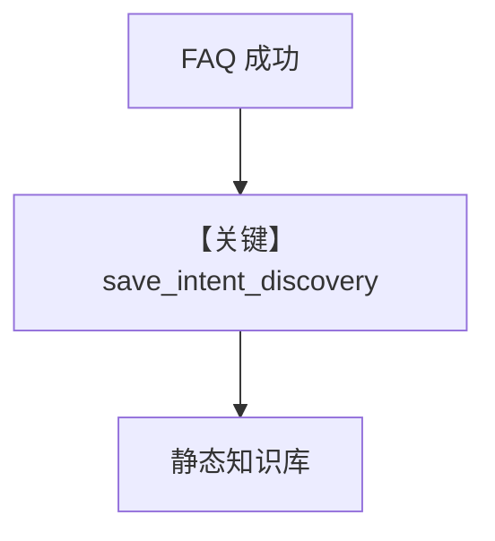

# save_discovery.py — 实现原理分析

> 源文件：`cookbook/01_demo/agents/scout/tools/save_discovery.py`

## 概述

**`create_save_intent_discovery_tool(knowledge)`** 生成 **`save_intent_discovery`**：把 **intent → s3 位置 → 有效搜索词** 以 JSON **`scout_knowledge.insert`** 持久化，强化后续 **相似问题** 的检索。仅允许 **`source`** 为 **`s3`**（校验 `L45-L47`）。

**核心配置一览：** 注入 `scout_knowledge`。

## 架构分层

```
成功回答后 → 模型调用 save_intent_discovery → knowledge.insert → 向量检索增强
```

## 核心组件解析

Payload `type: intent_discovery`（`save_discovery.py` L49+）便于与其它知识区分。

### 运行机制与因果链

**副作用**：写库；重复 name 行为取决于 `insert` 实现。

## System Prompt 组装

工具说明在 docstring；**instructions** 要求在高置信回答后保存可复用映射。

## 完整 API 请求

无。

## Mermaid 流程图



## 关键源码文件索引

| 文件 | 关键函数/类 | 作用 |
|------|------------|------|
| `save_discovery.py` | `create_save_intent_discovery_tool` L11 | 闭包 |
