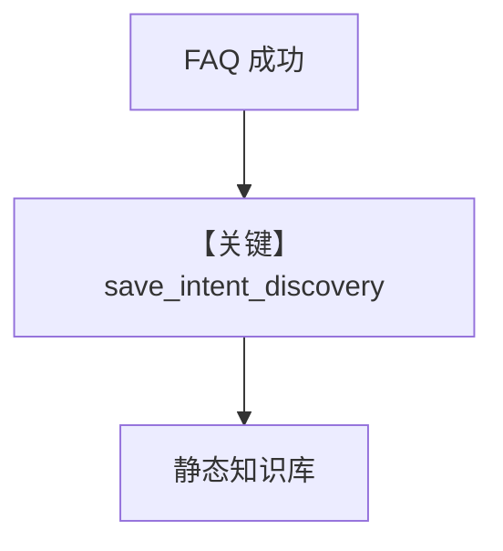

# save_discovery.py — 实现原理分析

<!-- cookbook-py-source:start -->
## 完整源码

```python
"""Save successful discoveries to knowledge base."""

import json

from agno.knowledge import Knowledge
from agno.knowledge.reader.text_reader import TextReader
from agno.tools import tool
from agno.utils.log import logger


def create_save_intent_discovery_tool(knowledge: Knowledge):
    """Create save_intent_discovery tool with knowledge injected."""

    @tool
    def save_intent_discovery(
        name: str,
        intent: str,
        location: str,
        source: str,
        summary: str | None = None,
        search_terms: list[str] | None = None,
    ) -> str:
        """Save a successful discovery to knowledge base for future reference.

        Call this after successfully finding information that might be useful for similar
        future queries. This helps Scout learn where information is typically found.

        Args:
            name: Short name for this discovery (e.g., "q4_okrs_location")
            intent: What the user was looking for (e.g., "Find Q4 OKRs")
            location: Where the information was found (e.g., "s3://company-docs/policies/handbook.md")
            source: Which source type (s3)
            summary: Brief description of what was found
            search_terms: Search terms that worked to find this
        """
        if not name or not name.strip():
            return "Error: Name required."
        if not intent or not intent.strip():
            return "Error: Intent required."
        if not location or not location.strip():
            return "Error: Location required."
        if not source or not source.strip():
            return "Error: Source required."

        valid_sources = ["s3"]
        if source.lower() not in valid_sources:
            return f"Error: Source must be one of: {', '.join(valid_sources)}"

        payload = {
            "type": "intent_discovery",
            "name": name.strip(),
            "intent": intent.strip(),
            "location": location.strip(),
            "source": source.strip().lower(),
            "summary": summary.strip() if summary else None,
            "search_terms": search_terms or [],
        }
        payload = {k: v for k, v in payload.items() if v is not None}

        try:
            knowledge.insert(
                name=name.strip(),
                text_content=json.dumps(payload, ensure_ascii=False, indent=2),
                reader=TextReader(),
                skip_if_exists=True,
            )
            return f"Saved discovery '{name}' to knowledge base."
        except (AttributeError, TypeError, ValueError, OSError) as e:
            logger.error(f"Failed to save discovery: {e}")
            return f"Error: {e}"

    return save_intent_discovery
```

<!-- cookbook-py-source:end -->

> 源文件：`cookbook/01_demo/agents/scout/tools/save_discovery.py`

## 概述

**`create_save_intent_discovery_tool(knowledge)`** 生成 **`save_intent_discovery`**：把 **intent → s3 位置 → 有效搜索词** 以 JSON **`scout_knowledge.insert`** 持久化，强化后续 **相似问题** 的检索。仅允许 **`source`** 为 **`s3`**（校验 `L45-L47`）。

**核心配置一览：** 注入 `scout_knowledge`。

## 架构分层

```
成功回答后 → 模型调用 save_intent_discovery → knowledge.insert → 向量检索增强
```

## 核心组件解析

Payload `type: intent_discovery`（`save_discovery.py` L49+）便于与其它知识区分。

### 运行机制与因果链

**副作用**：写库；重复 name 行为取决于 `insert` 实现。

## System Prompt 组装

工具说明在 docstring；**instructions** 要求在高置信回答后保存可复用映射。

## 完整 API 请求

无。

## Mermaid 流程图



## 关键源码文件索引

| 文件 | 关键函数/类 | 作用 |
|------|------------|------|
| `save_discovery.py` | `create_save_intent_discovery_tool` L11 | 闭包 |
