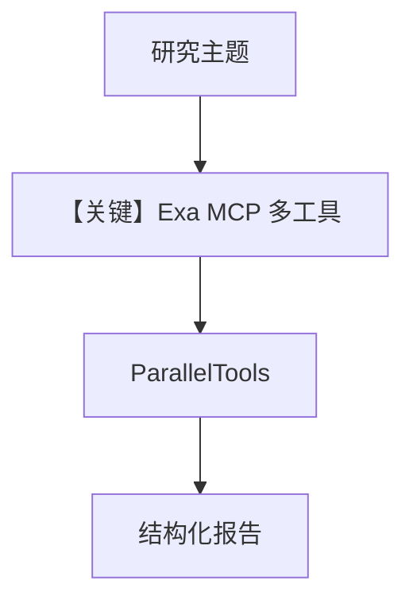

# agent.py — 实现原理分析

> 源文件：`cookbook/01_demo/agents/seek/agent.py`

## 概述

**Seek** 为 **深度调研**：**Exa MCP**（多工具 URL）+ **`ParallelTools`**，双 **Knowledge/LearningMachine**；**instructions** 定义四阶段（Scope、Gather、Analyze、Synthesize）与 **`save_learning`** 样例，强调引用与置信度。

**核心配置一览：**

| 配置项 | 值 | 说明 |
|--------|------|------|
| `id` / `name` | `"seek"` / `"Seek"` | 标识 |
| `model` | `OpenAIResponses(id="gpt-5.2")` | Responses API |
| `tools` | `MCPTools(EXA_MCP_URL)`, `ParallelTools(enable_extract=False)` | 外搜 |
| `knowledge` / `search_knowledge` | `seek_knowledge` / `True` | 是 |
| `learning` | `LearningMachine(AGENTIC)` | 是 |
| `read_chat_history` | `True` | 是 |
| `num_history_runs` | `5` | 是 |
| `markdown` | `True` | 是 |

## 架构分层

```
search_knowledge + search_learnings → Exa/parallel_search → 交叉验证 → 长文报告
```

## 核心组件解析

### Depth Calibration

指令用表格区分 quick/overview/deep（`seek/agent.py` L91-L100）。

### 运行机制与因果链

1. **副作用**：网络检索；向量库写入学习。
2. **与 Scout 差异**：Seek 偏 **外部公开信息**；Scout 偏 **内部 S3 文档**。

## System Prompt 组装

### 还原后的完整 System 文本

以 **`instructions`** 全文（L56-L164）为准。

## 完整 API 请求

**OpenAIResponses** + MCP/parallel 工具。

## Mermaid 流程图



## 关键源码文件索引

| 文件 | 关键函数/类 | 作用 |
|------|------------|------|
| `agno/tools/mcp/mcp.py` | `MCPTools` | 远程工具 |
| `agno/tools/parallel.py` | `ParallelTools` | 并行搜索 |
