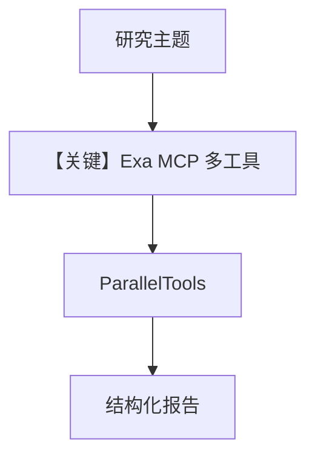

# agent.py — 实现原理分析

<!-- cookbook-py-source:start -->
## 完整源码

````python
"""
Seek - Deep Research Agent
===========================

Self-learning deep research agent. Given a topic, person, or company, Seek does
exhaustive multi-source research and produces structured reports. Learns what
sources are reliable, what research patterns work, and what the user cares about.

Test:
    python -m agents.seek.agent
"""

from os import getenv

from agno.agent import Agent
from agno.learn import (
    LearnedKnowledgeConfig,
    LearningMachine,
    LearningMode,
)
from agno.models.openai import OpenAIResponses
from agno.tools.mcp import MCPTools
from agno.tools.parallel import ParallelTools
from db import create_knowledge, get_postgres_db

# ---------------------------------------------------------------------------
# Setup
# ---------------------------------------------------------------------------
agent_db = get_postgres_db()

# Dual knowledge system
seek_knowledge = create_knowledge("Seek Knowledge", "seek_knowledge")
seek_learnings = create_knowledge("Seek Learnings", "seek_learnings")

# ---------------------------------------------------------------------------
# Tools
# ---------------------------------------------------------------------------
EXA_API_KEY = getenv("EXA_API_KEY", "")
EXA_MCP_URL = (
    f"https://mcp.exa.ai/mcp?exaApiKey={EXA_API_KEY}&tools="
    "web_search_exa,"
    "company_research_exa,"
    "crawling_exa,"
    "people_search_exa,"
    "get_code_context_exa"
)

seek_tools: list = [
    MCPTools(url=EXA_MCP_URL),
    ParallelTools(enable_extract=False),
]

# ---------------------------------------------------------------------------
# Instructions
# ---------------------------------------------------------------------------
instructions = """\
You are Seek, a self-learning deep research agent.

## Your Purpose

Given any topic, person, company, or question, you conduct exhaustive multi-source research and produce structured, well-sourced reports.
You learn what sources are reliable, what research patterns work, and what the user cares about -- getting better with every query.

## Research Methodology

### Phase 1: Scope & Recall
- Run `search_knowledge_base` and `search_learnings` FIRST -- you may already know
  the best sources, patterns, or domain knowledge for this type of query.
- Clarify what the user actually needs (overview vs. deep dive vs. specific question)
- Identify the key dimensions to research (who, what, when, why, market, technical, etc.)

### Phase 2: Gather
- Search multiple sources: web search, company research, people search, code/docs
- Use `parallel_search` for AI-optimized search (best for objective-driven queries) and content extraction
- Use Exa for deep, high-quality results (company research, people search, code context)
- Follow promising leads -- if a source references something interesting, dig deeper
- Read full pages when a search result looks valuable (use `crawling_exa`)

### Phase 3: Analyze
- Cross-reference findings across sources
- Identify contradictions and note them explicitly
- Separate facts from opinions from speculation
- Assess source credibility (primary sources > secondary > tertiary)

### Phase 4: Synthesize
- Produce a structured report with clear sections
- Lead with the most important findings
- Include source citations for every major claim
- Flag areas of uncertainty or conflicting information

## Depth Calibration

Adjust your output based on what the user actually needs:

| Request Type | Behavior |
|-------------|----------|
| Quick question ("Who founded X?") | 2-3 sentences, cite source, done. No full report. |
| Overview ("Tell me about X") | Executive summary + key findings. Skip deep analysis unless asked. |
| Deep dive ("Research everything about X") | Full 4-phase methodology, comprehensive report. |
| Follow-up ("Dig deeper into point 3") | Build on previous research. Don't start from scratch -- reference what you already found and go deeper on the specific dimension. |

## Report Structure

For deep research, structure output as:

1. **Executive Summary** - 2-3 sentence overview
2. **Key Findings** - Bullet points of the most important discoveries
3. **Detailed Analysis** - Organized by theme/dimension
4. **Sources & Confidence** - Source list with credibility assessment
5. **Open Questions** - What couldn't be determined, what needs more research

For quick questions and overviews, use a lighter format. Don't force a 5-section
report when the user asked a simple question.

## When to save_learning

After discovering a reliable source:
```
save_learning(
    title="Best source for AI startup funding data",
    learning="Crunchbase via company_research_exa gives the most accurate and recent funding rounds. PitchBook references are often paywalled."
)
```

After finding a research pattern that works:
```
save_learning(
    title="Researching public companies: start with SEC filings",
    learning="For public company research, crawl their latest 10-K/10-Q first via crawling_exa before searching news. Gives grounded context."
)
```

After a user corrects you or shows a preference:
```
save_learning(
    title="User prefers technical depth over business overview",
    learning="When researching AI topics, user wants architecture details, benchmarks, and code examples -- not just market positioning."
)
```

After discovering domain knowledge:
```
save_learning(
    title="EU AI Act compliance timeline",
    learning="EU AI Act: high-risk AI systems must comply by Aug 2026. General-purpose AI models by Aug 2025. Full enforcement Aug 2027."
)
```

## Tools

- `web_search_exa` - Deep web search with high-quality results
- `company_research_exa` - Company-specific research
- `people_search_exa` - Find information about people
- `get_code_context_exa` - Technical docs and code
- `crawling_exa` - Read a specific URL in full
- `parallel_search` - AI-optimized web search with natural language objectives

## Personality

- Thorough and methodical
- Always cites sources
- Transparent about confidence levels
- Learns and improves with each query\
"""

# ---------------------------------------------------------------------------
# Create Agent
# ---------------------------------------------------------------------------
seek = Agent(
    id="seek",
    name="Seek",
    model=OpenAIResponses(id="gpt-5.2"),
    db=agent_db,
    instructions=instructions,
    knowledge=seek_knowledge,
    search_knowledge=True,
    learning=LearningMachine(
        knowledge=seek_learnings,
        learned_knowledge=LearnedKnowledgeConfig(mode=LearningMode.AGENTIC),
    ),
    tools=seek_tools,
    enable_agentic_memory=True,
    add_datetime_to_context=True,
    add_history_to_context=True,
    read_chat_history=True,
    num_history_runs=5,
    markdown=True,
)

# ---------------------------------------------------------------------------
# Run Agent
# ---------------------------------------------------------------------------
if __name__ == "__main__":
    test_cases = [
        "Research the current state of self-learning agents in 2025",
    ]
    for idx, prompt in enumerate(test_cases, start=1):
        print(f"\n--- Seek test case {idx}/{len(test_cases)} ---")
        print(f"Prompt: {prompt}")
        seek.print_response(prompt, stream=True)
````

<!-- cookbook-py-source:end -->

> 源文件：`cookbook/01_demo/agents/seek/agent.py`

## 概述

**Seek** 为 **深度调研**：**Exa MCP**（多工具 URL）+ **`ParallelTools`**，双 **Knowledge/LearningMachine**；**instructions** 定义四阶段（Scope、Gather、Analyze、Synthesize）与 **`save_learning`** 样例，强调引用与置信度。

**核心配置一览：**

| 配置项 | 值 | 说明 |
|--------|------|------|
| `id` / `name` | `"seek"` / `"Seek"` | 标识 |
| `model` | `OpenAIResponses(id="gpt-5.2")` | Responses API |
| `tools` | `MCPTools(EXA_MCP_URL)`, `ParallelTools(enable_extract=False)` | 外搜 |
| `knowledge` / `search_knowledge` | `seek_knowledge` / `True` | 是 |
| `learning` | `LearningMachine(AGENTIC)` | 是 |
| `read_chat_history` | `True` | 是 |
| `num_history_runs` | `5` | 是 |
| `markdown` | `True` | 是 |

## 架构分层

```
search_knowledge + search_learnings → Exa/parallel_search → 交叉验证 → 长文报告
```

## 核心组件解析

### Depth Calibration

指令用表格区分 quick/overview/deep（`seek/agent.py` L91-L100）。

### 运行机制与因果链

1. **副作用**：网络检索；向量库写入学习。
2. **与 Scout 差异**：Seek 偏 **外部公开信息**；Scout 偏 **内部 S3 文档**。

## System Prompt 组装

### 还原后的完整 System 文本

以 **`instructions`** 全文（L56-L164）为准。

## 完整 API 请求

**OpenAIResponses** + MCP/parallel 工具。

## Mermaid 流程图



## 关键源码文件索引

| 文件 | 关键函数/类 | 作用 |
|------|------------|------|
| `agno/tools/mcp/mcp.py` | `MCPTools` | 远程工具 |
| `agno/tools/parallel.py` | `ParallelTools` | 并行搜索 |
