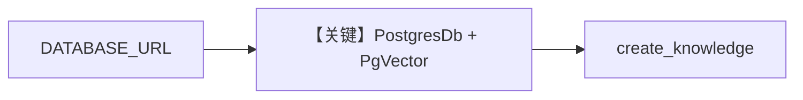

# db.py — 实现原理分析

<!-- cookbook-py-source:start -->
## 完整源码

```python
"""Database configuration."""

from os import getenv

from agno.db.postgres import PostgresDb
from agno.knowledge import Knowledge
from agno.knowledge.embedder.openai import OpenAIEmbedder
from agno.vectordb.pgvector import PgVector, SearchType

db_url = getenv("DATABASE_URL", "postgresql+psycopg://ai:ai@localhost:5532/ai")


def get_postgres_db(contents_table: str | None = None) -> PostgresDb:
    if contents_table is not None:
        return PostgresDb(id="demo-db", db_url=db_url, knowledge_table=contents_table)
    return PostgresDb(id="demo-db", db_url=db_url)


def create_knowledge(name: str, table_name: str) -> Knowledge:
    return Knowledge(
        name=name,
        vector_db=PgVector(
            db_url=db_url,
            table_name=table_name,
            search_type=SearchType.hybrid,
            embedder=OpenAIEmbedder(id="text-embedding-3-small"),
        ),
        contents_db=get_postgres_db(contents_table=f"{table_name}_contents"),
        max_results=10,
    )
```

<!-- cookbook-py-source:end -->

> 源文件：`cookbook/01_demo/db.py`

## 概述

集中提供 **`DATABASE_URL`** 默认连接串、**`get_postgres_db`** 工厂与 **`create_knowledge`**：PgVector + **`OpenAIEmbedder(text-embedding-3-small)`** + hybrid 检索，内容为 **`PostgresDb`** 的 `contents_db` 表（按 `table_name` 分表）。供 **Dash/Gcode/Pal/Scout/Seek** 及 **`01_demo/run.py`** 复用。

**核心配置一览：** 无 Agent；函数参数见下表。

| 函数 | 作用 |
|------|------|
| `get_postgres_db(contents_table=...)` | 返回 `PostgresDb(id="demo-db", ...)` |
| `create_knowledge(name, table_name)` | 返回绑定 PgVector 的 `Knowledge` |

## 架构分层

```
环境变量 DATABASE_URL → PostgresDb / PgVector → 各 demo Agent
```

## 核心组件解析

### create_knowledge

`vector_db=PgVector(db_url, table_name, SearchType.hybrid, OpenAIEmbedder)`，`contents_db=get_postgres_db(contents_table=f"{table_name}_contents")`（`db.py` L19-L30）。

### 运行机制与因果链

1. **副作用**：所有依赖 demo 的 Agent 共享同一 Postgres 实例；不同 `table_name` 分表隔离向量与内容。
2. **分支**：`contents_table` 可覆盖（如 Pal `pal_contents`）。

## System Prompt 组装

不适用本文件。

## 完整 API 请求

不适用；底层为 DB 与嵌入 API（嵌入在 `knowledge.search` 路径触发）。

## Mermaid 流程图



## 关键源码文件索引

| 文件 | 关键函数/类 | 作用 |
|------|------------|------|
| `agno/db/postgres.py` | `PostgresDb` | 会话与内容 |
| `agno/vectordb/pgvector/` | `PgVector` | 向量检索 |
| `cookbook/01_demo/db.py` | `create_knowledge` L19 | 知识库工厂 |
