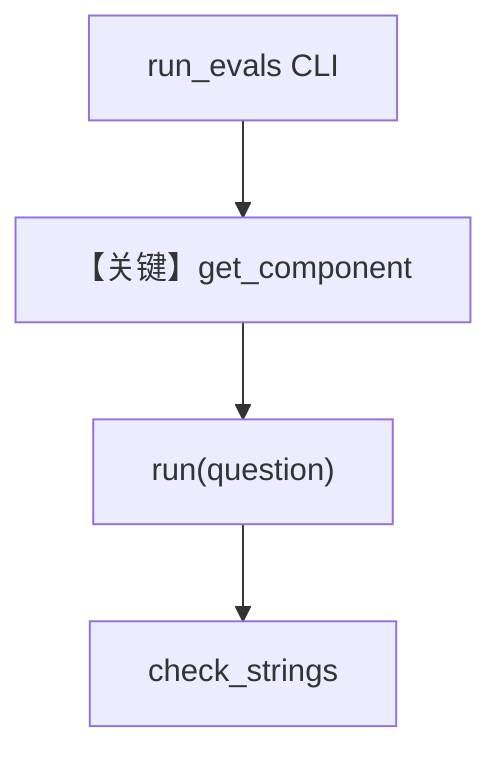

# run_evals.py — 实现原理分析

> 源文件：`cookbook/01_demo/evals/run_evals.py`

## 概述

**评测驱动脚本**：按 **`test_cases.py`** 中的 **`TestCase`** 对指定 **agent/team/workflow** 执行 **`run()`**，用 **`check_strings`** 检查响应是否包含期望子串，**Rich** 输出表格/进度。**无 Agent 定义**，不经过 `get_system_message` 拼装逻辑本身。

**核心配置一览：** CLI `argparse`；**`get_component(agent_id)`** 动态 import 各 demo 实体。

## 架构分层

```
argparse → get_component(id) → component.run(question) → 字符串包含检查
```

## 核心组件解析

### get_component

映射 `gcode`/`dash`/`pal`/`scout`/`seek`/`research-team`/`daily-brief` 到对应模块实例（`run_evals.py` L44+）。

### 运行机制与因果链

1. **副作用**：调用真实模型与工具，产生费用与 DB 写入。
2. **分支**：`--agent` 过滤；`match_mode` all/any。

## System Prompt 组装

不适用本脚本；**被测组件**各自有 system。

## 完整 API 请求

间接：**被测 Agent** 使用其配置的 **OpenAIResponses** 等。

## Mermaid 流程图



## 关键源码文件索引

| 文件 | 关键函数/类 | 作用 |
|------|------------|------|
| `evals/run_evals.py` | `get_component` L44 | 实体解析 |
| `evals/test_cases.py` | `TestCase` | 用例数据 |
