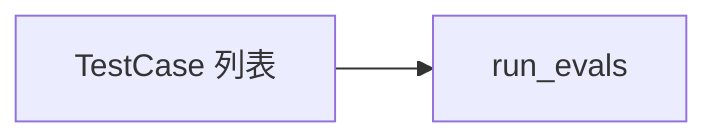

# test_cases.py — 实现原理分析

> 源文件：`cookbook/01_demo/evals/test_cases.py`

## 概述

声明 **`TestCase`** 数据类及 **`GCODE_TESTS`、`DASH_TESTS`、`PAL_TESTS` 等**列表，聚合为 **`ALL_TEST_CASES`** 与 **`CATEGORIES`**，供 **`run_evals.py`** 遍历。纯数据模块，**无 Agent、无 API**。

**核心配置一览：** `TestCase(agent, question, expected_strings, category, match_mode)`。

## 架构分层

```
评测用例数据 → run_evals 消费
```

## 核心组件解析

每个用例针对特定 **agent id** 与**可观测输出**（字符串包含），属于粗粒度冒烟而非单元测试。

### 运行机制与因果链

静态数据；修改用例即改变评测覆盖。

## System Prompt 组装

不适用。

## 完整 API 请求

不适用。

## Mermaid 流程图



## 关键源码文件索引

| 文件 | 关键函数/类 | 作用 |
|------|------------|------|
| `test_cases.py` | `TestCase` L11 | 用例结构 |
