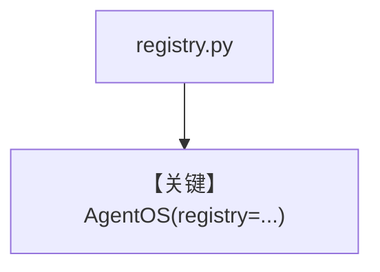

# registry.py — 实现原理分析

> 源文件：`cookbook/01_demo/registry.py`

## 概述

构造全局 **`Registry`**：**`ParallelTools`**、**`OpenAIResponses` 多模型 id**、**`demo_db`**，供 **`01_demo/run.py` 的 `AgentOS(..., registry=registry)`** 在 OS 层暴露共享工具/模型/DB。本文件**不创建 Agent**。

**核心配置一览：**

| Registry 字段 | 值 |
|--------------|-----|
| `tools` | `[ParallelTools()]` |
| `models` | `gpt-5.2`, `gpt-5-mini` Responses |
| `dbs` | `[demo_db]` |

## 架构分层

```
registry → AgentOS → Web UI 选择共享资源
```

## 核心组件解析

`Registry` 类见 `agno/registry`；用于 AgentOS 的服务发现/注入。

### 运行机制与因果链

Import 时创建单例式 registry；与单独 `python -m agents.dash.agent` 无强制关系。

## System Prompt 组装

不适用。

## 完整 API 请求

不适用；OS 通过 registry 提供模型与工具元数据。

## Mermaid 流程图



## 关键源码文件索引

| 文件 | 关键函数/类 | 作用 |
|------|------------|------|
| `agno/registry/__init__.py` | `Registry` | OS 注册表 |
