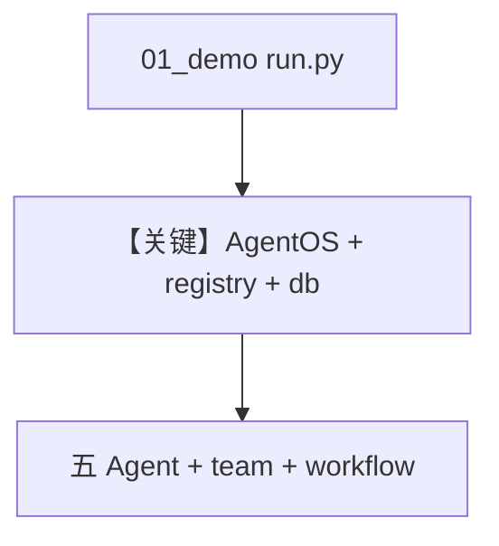

# run.py — 实现原理分析

> 源文件：`cookbook/01_demo/run.py`

## 概述

**01_demo 的 AgentOS 入口**：导入 **dash/gcode/pal/scout/seek** 五个 Agent、**research_team**、**daily_brief_workflow**，传入 **`registry`**、**`get_postgres_db()`**、**`config.yaml`**，**`tracing`/`scheduler`** 开启。`**`app = agent_os.get_app()`** 供 ASGI 服务。

**核心配置一览：**

| 字段 | 值 |
|------|-----|
| `agents` | 五 demo agent |
| `teams` | `[research_team]` |
| `workflows` | `[daily_brief_workflow]` |
| `registry` | `registry` 模块 |
| `db` | `get_postgres_db()` |
| `config` | `config.yaml` |

## 架构分层

```
import 预构造实例 → AgentOS → serve(reload=True)
```

## 核心组件解析

与 `00_quickstart/run.py` 类似，但实体为 **01_demo** 全套 + **Registry** + **Postgres**。

### 运行机制与因果链

**副作用**：监听端口；连接 DB；各 Agent 共用或分用 DB 依模块定义。

## System Prompt 组装

无统一 system；见各 Agent/Team/Workflow 文档。

## 完整 API 请求

HTTP/WebSocket 经 AgentOS；内部再调 **OpenAIResponses**。

## Mermaid 流程图



## 关键源码文件索引

| 文件 | 关键函数/类 | 作用 |
|------|------------|------|
| `agno/os/app.py` | `AgentOS` L190+ | 应用组装 |
