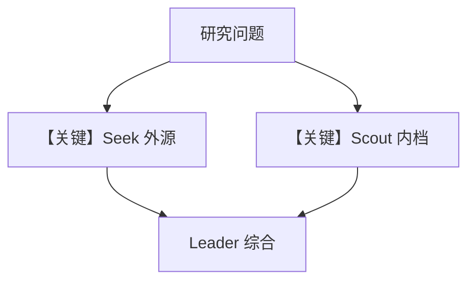

# team.py — 实现原理分析

> 源文件：`cookbook/01_demo/teams/research/team.py`

## 概述

定义 **`research_team`**：**`Team`** Leader 为 **`OpenAIResponses(id="gpt-5.2")`**，成员为已构造的 **`seek`** 与 **`scout`** 实例（**直接复用模块级 Agent**），**`instructions` 为 list[str]** 描述分工与输出结构，**`db=get_postgres_db(contents_table="research_team_contents")`** 隔离内容表。

**核心配置一览：**

| 配置项 | 值 |
|--------|-----|
| `id` / `name` | `research-team` / `Research Team` |
| `model` | `OpenAIResponses(gpt-5.2)` |
| `members` | `[seek, scout]` |
| `instructions` | 多段字符串列表 |
| `show_members_responses` | `True` |
| `markdown` | `True` |
| `add_datetime_to_context` | `True` |

## 架构分层

```
用户 → Team.run → 委派 Seek(外研) / Scout(内档) → Leader 综合报告
```

## 核心组件解析

Seek 与 Scout **共享同一 `db_url` 逻辑**但 **research_team** 使用独立 **contents_table**。

### 运行机制与因果链

1. **路径**：复杂研究问题拆维 → 成员并行/串行（以 Team 实现为准）→ 合成。
2. **定位**：**内外结合**调研场景。

## System Prompt 组装

**Leader** 与 **成员** 各有 system；成员即原 Agent 的 instructions。

### 还原后的完整 System 文本（Leader instructions 拼接）

以 **`instructions=[...]`** 列表项合并为单一 system 的逻辑为准（见 `Team` 实现）；原文为 `team.py` L28-L44 各字符串。

## 完整 API 请求

多次 **OpenAIResponses** 调用。

## Mermaid 流程图



## 关键源码文件索引

| 文件 | 关键函数/类 | 作用 |
|------|------------|------|
| `agno/team/team.py` | `Team` L71+ | 协调 |
| `agents/seek/agent.py` | `seek` | 成员 |
| `agents/scout/agent.py` | `scout` | 成员 |
