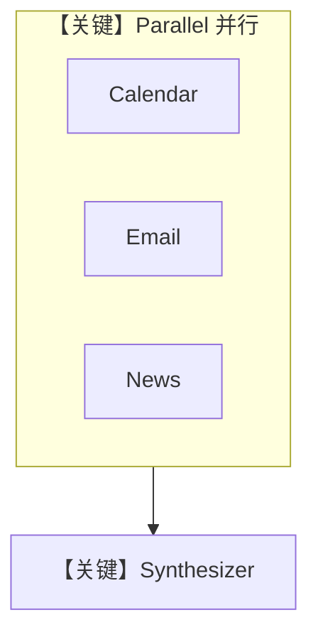

# workflow.py — 实现原理分析

> 源文件：`cookbook/01_demo/workflows/daily_brief/workflow.py`

## 概述

**`daily_brief_workflow`**：**`Parallel`** 包裹三个 **Step**（calendar_agent / email_agent / news_agent）并行采集，再 **Step(synthesizer)** 合并为晨报；工具含 **mock `get_todays_calendar`、`get_email_digest`** 与 **`ParallelTools`**。全链路 **OpenAIResponses**，**无 OAuth**。

**核心配置一览：**

| 实体 | 说明 |
|------|------|
| `Workflow` | `id=daily-brief`，`steps=[Parallel(...), Step(Synthesize)]` |
| `calendar_agent` / `email_agent` | 各绑定单工具 mock |
| `news_agent` | `ParallelTools(enable_extract=False)` |
| `synthesizer` | 无工具，list instructions，`markdown=True` |

## 架构分层

```
用户 → Parallel(三代理并行) → 合成 Agent → Markdown 晨报
```

## 核心组件解析

### Parallel + Step

见 `agno/workflow/parallel.py` 与 `workflow.py` L166+：先 **Gather Intelligence** 再 **Synthesize Brief**。

### Mock 工具

返回固定多行字符串，演示日程/邮件（`workflow.py` L32-94）。

### 运行机制与因果链

1. **副作用**：LLM 多调用；无真实日历 API。
2. **与 sequential_workflow（00_quickstart）差异**：本例 **并行** 第一步。

## System Prompt 组装

分属四 Agent；**synthesizer** 的 instructions 定义 **## Today at a Glance** 等结构（`workflow.py` L139-159）。

### 还原后的完整 System 文本（Synthesizer）

以 **`synthesizer` 的 `instructions=[...]`** 列表原文为准。

## 完整 API 请求

多轮 **OpenAIResponses**；并行步可能并发或顺序（依 Workflow 引擎）。

## Mermaid 流程图



## 关键源码文件索引

| 文件 | 关键函数/类 | 作用 |
|------|------------|------|
| `agno/workflow/workflow.py` | `Workflow` L208+ | 编排 |
| `agno/workflow/parallel.py` | `Parallel` | 并行步 |
