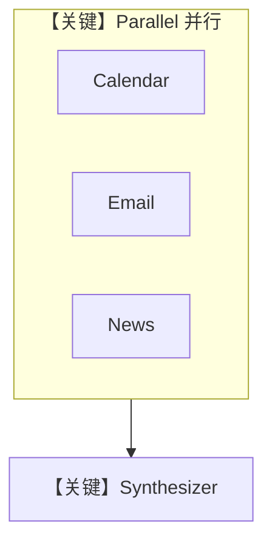

# workflow.py — 实现原理分析

<!-- cookbook-py-source:start -->
## 完整源码

```python
"""
Daily Brief Workflow
=====================

Scheduled morning workflow that compiles a personalized daily briefing.
Pulls from calendar, email, research, and data to give the user a complete
picture of their day.

Steps:
1. Parallel: Calendar scan + Email digest + News/Research
2. Synthesize into a daily brief

Since we don't have Google OAuth credentials, calendar and email data
is provided via mock tools.

Test:
    python -m workflows.daily_brief.workflow
"""

from agno.agent import Agent
from agno.models.openai import OpenAIResponses
from agno.tools import tool
from agno.tools.parallel import ParallelTools
from agno.workflow import Step, Workflow
from agno.workflow.parallel import Parallel

# ---------------------------------------------------------------------------
# Mock Tools (no Google OAuth available)
# ---------------------------------------------------------------------------


@tool(description="Get today's calendar events. Returns mock data for demo purposes.")
def get_todays_calendar() -> str:
    """Returns mock calendar events for the day."""
    return """
Today's Calendar (Thursday, February 6, 2025):

09:00 - 09:30 | Daily Standup
  Location: Zoom
  Attendees: Engineering team (Sarah Chen, Mike Rivera, Priya Patel)
  Notes: Sprint review week - come prepared with demo updates

10:00 - 11:00 | Product Strategy Review
  Location: Conference Room A
  Attendees: CEO (James Wilson), VP Product (Lisa Zhang), You
  Notes: Q1 roadmap finalization, budget discussion

12:00 - 12:30 | 1:1 with Sarah Chen
  Location: Zoom
  Attendees: Sarah Chen (Staff Engineer)
  Notes: Career growth discussion, tech lead promotion path

14:00 - 15:00 | Investor Update Prep
  Location: Your office
  Attendees: CFO (Robert Kim), You
  Notes: Prepare slides for next week's board meeting

16:00 - 16:30 | Interview: Senior Backend Engineer
  Location: Zoom
  Attendees: Candidate (Alex Thompson), You, Mike Rivera
  Notes: System design round
"""


@tool(description="Get today's email digest. Returns mock data for demo purposes.")
def get_email_digest() -> str:
    """Returns mock email digest for the day."""
    return """
Email Digest (last 24 hours):

URGENT:
- From: Robert Kim (CFO) - "Q4 Revenue Numbers Final" - Sent 11:30 PM
  Preview: Final Q4 numbers are in. Revenue up 23% YoY. Need to discuss board deck.

- From: Sarah Chen - "Production Incident - Resolved" - Sent 2:15 AM
  Preview: API latency spike at 1:45 AM. Root cause: database connection pool exhaustion. Resolved by 2:10 AM. Post-mortem scheduled.

ACTION REQUIRED:
- From: Lisa Zhang (VP Product) - "Q1 Roadmap - Your Input Needed" - Sent 8:00 AM
  Preview: Need your engineering capacity estimates by EOD for the product strategy review.

- From: HR (Maria Santos) - "Sarah Chen Promotion Packet" - Sent yesterday
  Preview: Please review and approve Sarah's tech lead promotion packet before your 1:1.

FYI:
- From: Mike Rivera - "Interview Prep: Alex Thompson" - Sent 7:30 AM
  Preview: Attached resume and system design question options for today's interview.

- From: Engineering-all - "New deployment pipeline live" - Sent yesterday
  Preview: CI/CD improvements are live. Build times reduced by 40%.

- From: investor-relations@company.com - "Board Meeting Reminder" - Sent yesterday
  Preview: Board meeting next Thursday. Deck due by Monday.
"""


# ---------------------------------------------------------------------------
# Workflow Agents
# ---------------------------------------------------------------------------
calendar_agent = Agent(
    name="Calendar Scanner",
    model=OpenAIResponses(id="gpt-5.2"),
    tools=[get_todays_calendar],
    instructions=[
        "You scan today's calendar and produce a concise summary.",
        "For each meeting, note: time, who's involved, what to prepare.",
        "Flag any back-to-back meetings or scheduling conflicts.",
        "Highlight the most important meeting of the day.",
    ],
)

email_agent = Agent(
    name="Email Digester",
    model=OpenAIResponses(id="gpt-5.2"),
    tools=[get_email_digest],
    instructions=[
        "You process the email digest and produce a prioritized summary.",
        "Categorize: urgent/action required/FYI.",
        "For action items, note what specifically needs to be done.",
        "Connect emails to today's calendar when relevant.",
    ],
)

news_agent = Agent(
    name="News Scanner",
    model=OpenAIResponses(id="gpt-5.2"),
    tools=[ParallelTools(enable_extract=False)],
    instructions=[
        "You scan for relevant news and industry updates.",
        "Focus on: AI/ML developments, competitor news, market trends.",
        "Keep it brief -- 3-5 most relevant items.",
        "Include source links.",
    ],
)

synthesizer = Agent(
    name="Brief Synthesizer",
    model=OpenAIResponses(id="gpt-5.2"),
    instructions=[
        "You compile inputs from calendar, email, and news into a cohesive daily brief.",
        "",
        "Structure the brief as:",
        "## Today at a Glance",
        "- One-line summary of the day",
        "",
        "## Priority Actions",
        "- Top 3-5 things that need attention today (from email + calendar)",
        "",
        "## Schedule",
        "- Today's meetings with prep notes",
        "",
        "## Inbox Highlights",
        "- Key emails summarized",
        "",
        "## Industry Pulse",
        "- Brief news summary",
        "",
        "Keep it scannable. The user should be able to read this in 2 minutes.",
    ],
    markdown=True,
)

# ---------------------------------------------------------------------------
# Workflow
# ---------------------------------------------------------------------------
daily_brief_workflow = Workflow(
    id="daily-brief",
    name="Daily Brief",
    steps=[
        Parallel(
            Step(name="Scan Calendar", agent=calendar_agent),
            Step(name="Process Emails", agent=email_agent),
            Step(name="Scan News", agent=news_agent),
            name="Gather Intelligence",
        ),
        Step(name="Synthesize Brief", agent=synthesizer),
    ],
)

if __name__ == "__main__":
    test_cases = [
        "Generate my daily brief for today",
        "Generate a concise daily brief and prioritize urgent action items.",
    ]
    for idx, prompt in enumerate(test_cases, start=1):
        print(f"\n--- Daily brief workflow test case {idx}/{len(test_cases)} ---")
        print(f"Prompt: {prompt}")
        daily_brief_workflow.print_response(prompt, stream=True)
```

<!-- cookbook-py-source:end -->

> 源文件：`cookbook/01_demo/workflows/daily_brief/workflow.py`

## 概述

**`daily_brief_workflow`**：**`Parallel`** 包裹三个 **Step**（calendar_agent / email_agent / news_agent）并行采集，再 **Step(synthesizer)** 合并为晨报；工具含 **mock `get_todays_calendar`、`get_email_digest`** 与 **`ParallelTools`**。全链路 **OpenAIResponses**，**无 OAuth**。

**核心配置一览：**

| 实体 | 说明 |
|------|------|
| `Workflow` | `id=daily-brief`，`steps=[Parallel(...), Step(Synthesize)]` |
| `calendar_agent` / `email_agent` | 各绑定单工具 mock |
| `news_agent` | `ParallelTools(enable_extract=False)` |
| `synthesizer` | 无工具，list instructions，`markdown=True` |

## 架构分层

```
用户 → Parallel(三代理并行) → 合成 Agent → Markdown 晨报
```

## 核心组件解析

### Parallel + Step

见 `agno/workflow/parallel.py` 与 `workflow.py` L166+：先 **Gather Intelligence** 再 **Synthesize Brief**。

### Mock 工具

返回固定多行字符串，演示日程/邮件（`workflow.py` L32-94）。

### 运行机制与因果链

1. **副作用**：LLM 多调用；无真实日历 API。
2. **与 sequential_workflow（00_quickstart）差异**：本例 **并行** 第一步。

## System Prompt 组装

分属四 Agent；**synthesizer** 的 instructions 定义 **## Today at a Glance** 等结构（`workflow.py` L139-159）。

### 还原后的完整 System 文本（Synthesizer）

以 **`synthesizer` 的 `instructions=[...]`** 列表原文为准。

## 完整 API 请求

多轮 **OpenAIResponses**；并行步可能并发或顺序（依 Workflow 引擎）。

## Mermaid 流程图



## 关键源码文件索引

| 文件 | 关键函数/类 | 作用 |
|------|------------|------|
| `agno/workflow/workflow.py` | `Workflow` L208+ | 编排 |
| `agno/workflow/parallel.py` | `Parallel` | 并行步 |
