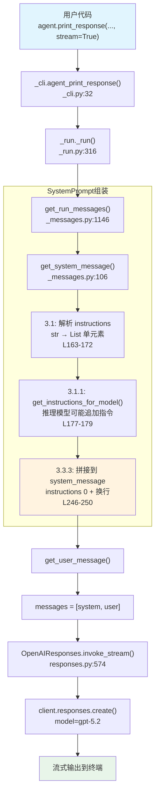

# agent_with_instructions.py — 实现原理分析

> 源文件：`cookbook/02_agents/01_quickstart/agent_with_instructions.py`

## 概述

本示例展示 Agno 的 **`instructions` 指令注入** 机制：通过 `instructions` 参数为 Agent 设定行为规范，Agno 在 `get_system_message()` 中将其自动拼接到 system prompt 发送给模型。这是控制 Agent 输出风格和行为最直接的方式。

**核心配置一览：**

| 配置项 | 值 | 说明 |
|--------|------|------|
| `name` | `"Instruction-Tuned Agent"` | Agent 名称 |
| `model` | `OpenAIResponses(id="gpt-5.2")` | OpenAI Responses API |
| `instructions` | `"You are a concise assistant.\nAnswer with exactly 3 bullet points when possible."` | 行为指令 |
| `tools` | `None` | 未设置 |
| `description` | `None` | 未设置 |
| `markdown` | `False` | 默认不启用 |
| `use_instruction_tags` | `False` | 不用 XML 标签包裹指令 |
| `build_context` | `True` | 默认构建上下文 |

## 架构分层

```
用户代码层                       agno.agent 层
┌───────────────────────┐     ┌──────────────────────────────────────┐
│ agent_with_           │     │ _run._run()  L316                    │
│   instructions.py     │     │  ├─ get_system_message()  L106      │
│                       │     │  │   3.1: 解析 instructions          │
│ instructions=         │     │  │        str → List[str]            │
│  "You are a concise   │────>│  │   3.3.3: 拼接到 system_message   │
│   assistant.           │     │  │        → instructions[0] + "\n\n"│
│   Answer with exactly │     │  │                                   │
│   3 bullet points..." │     │  ├─ get_run_messages()  L1146       │
│                       │     │  │   → [system, user]                │
└───────────────────────┘     └──────────────────────────────────────┘
                                       │
                                       ▼
                              ┌────────────────────┐
                              │ OpenAIResponses L31 │
                              │ id="gpt-5.2"       │
                              │ role_map: system    │
                              │   → developer  L84 │
                              └────────────────────┘
```

## 核心组件解析

### instructions 参数定义

`instructions` 在 `Agent` 类（`agent.py:229`）中定义，支持三种类型：

```python
instructions: Optional[Union[str, List[str], Callable]] = None  # L229
use_instruction_tags: bool = False  # L231 是否用 <instructions> 标签包裹
```

### instructions 解析（步骤 3.1）

`get_system_message()`（`_messages.py:163-174`）解析 instructions：

```python
# 3.1 构建指令列表
instructions: List[str] = []
if agent.instructions is not None:
    _instructions = agent.instructions
    if callable(agent.instructions):          # 支持动态生成
        _instructions = execute_instructions(agent=agent, ...)
    if isinstance(_instructions, str):        # 本示例走这个分支
        instructions.append(_instructions)    # L172
    elif isinstance(_instructions, list):
        instructions.extend(_instructions)    # L174
```

### instructions 拼接（步骤 3.3.3）

`_messages.py:235-250` 将 instructions 写入 system message：

```python
# 3.3.3 拼接指令到 system_message_content
if len(instructions) > 0:
    if agent.use_instruction_tags:        # False → 跳过 XML 标签
        ...
    else:
        if len(instructions) > 1:         # 多条 → 每条前加 "- "
            for _upi in instructions:
                system_message_content += f"- {_upi}\n"
        else:                             # 单条 → 直接拼接（本示例）
            system_message_content += instructions[0] + "\n\n"  # L250
```

**指令格式对比：**

| 场景 | 格式 | 示例 |
|------|------|------|
| 单条 str（本示例） | 直接拼接 + `\n\n` | `You are a concise assistant.\n\n` |
| 多条 list | 每条前加 `- ` | `- Rule 1\n- Rule 2\n` |
| `use_instruction_tags=True` | XML 包裹 | `<instructions>\n- Rule 1\n</instructions>` |

### 模型指令补充（步骤 3.1.1）

`_messages.py:177-179` 检查模型是否有额外指令：

```python
_model_instructions = agent.model.get_instructions_for_model(tools)  # L177
if _model_instructions is not None:
    instructions.extend(_model_instructions)  # L179
```

gpt-5.2 是推理模型（`_using_reasoning_model()` L93 返回 True），可能自动注入推理相关指令。

## System Prompt 组装

| 序号 | 组成部分 | 本文件中的值/来源 | 是否生效 |
|------|---------|-----------------|---------|
| 1 | `system_message`（自定义） | `None` | 否（进入默认构建） |
| 3.1 | `instructions` | `"You are a concise assistant.\nAnswer with exactly 3 bullet points when possible."` | **是** |
| 3.1.1 | 模型指令（`get_instructions_for_model`） | gpt-5.2 推理模型，可能注入指令 | 可能 |
| 3.2.1 | `markdown` | `False` | 否 |
| 3.2.2 | `add_datetime_to_context` | `False` | 否 |
| 3.2.3 | `add_location_to_context` | `False` | 否 |
| 3.2.4 | `add_name_to_context` | `False` | 否 |
| 3.3.1 | `description` | `None` | 否 |
| 3.3.2 | `role` | `None` | 否 |
| 3.3.3 | instructions 拼接 | 单条 str → 直接拼接 | **是** |
| 3.3.4 | additional_information | 空列表 | 否 |
| 3.3.5 | `_tool_instructions` | `None` | 否 |
| 3.3.7 | `expected_output` | `None` | 否 |
| 3.3.8 | `additional_context` | `None` | 否 |
| 3.3.9 | `add_memories_to_context` | `None` | 否 |

### 最终 System Prompt

```text
You are a concise assistant.
Answer with exactly 3 bullet points when possible.

```

> instructions 字符串在步骤 3.3.3（L250）被原样拼接，末尾附加 `\n\n`。

## 完整 API 请求

```python
client.responses.create(
    model="gpt-5.2",
    input=[
        # 1. System Message（instructions 构成 prompt 主体）
        {
            "role": "developer",
            "content": "You are a concise assistant.\nAnswer with exactly 3 bullet points when possible.\n\n"
        },
        # 2. 用户输入
        {
            "role": "user",
            "content": "How can I improve my Python debugging workflow?"
        }
    ],
    reasoning={},  # gpt-5.2 推理模型自动添加
    stream=True
)
```

> Responses API 用 `input` 参数，role 经 `role_map`（L84）映射 `system→developer`。

## Mermaid 流程图



## 关键源码文件索引

| 文件 | 关键函数/类 | 作用 |
|------|------------|------|
| `agno/agent/agent.py` | `instructions` L229 | 指令属性定义（str/list/callable） |
| `agno/agent/agent.py` | `use_instruction_tags` L231 | 控制是否用 XML 标签包裹 |
| `agno/agent/agent.py` | `print_response()` L1053 | 用户调用入口 |
| `agno/agent/_cli.py` | `agent_print_response()` L32 | 分发流式/非流式输出 |
| `agno/agent/_run.py` | `_run()` L316 | Agent 核心执行循环 |
| `agno/agent/_messages.py` | `get_system_message()` L106 | 构建 system prompt |
| `agno/agent/_messages.py` | 步骤 3.1 L163-174 | 解析 instructions（str→list） |
| `agno/agent/_messages.py` | 步骤 3.1.1 L177-179 | 模型额外指令注入 |
| `agno/agent/_messages.py` | 步骤 3.3.3 L235-250 | instructions 拼接到 system message |
| `agno/agent/_messages.py` | `get_run_messages()` L1146 | 组装 [system, user] 消息列表 |
| `agno/models/openai/responses.py` | `OpenAIResponses` L31 | Responses API 模型适配 |
| `agno/models/openai/responses.py` | `role_map` L84 | system→developer 角色映射 |
