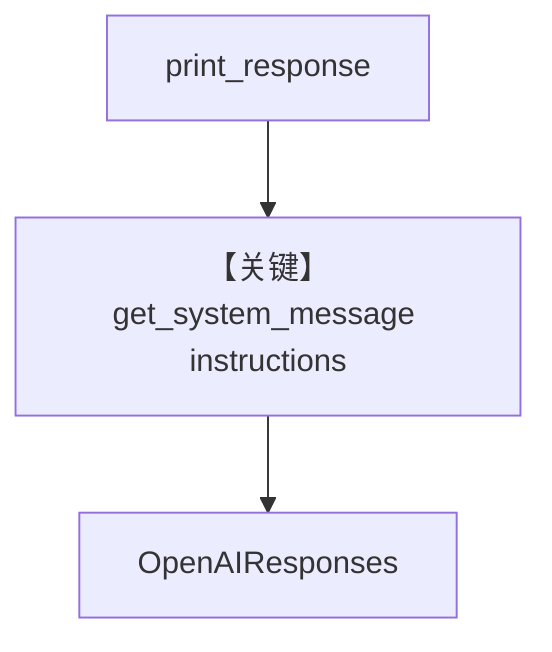

# agent_with_instructions.py — 实现原理分析

> 源文件：`cookbook/02_agents/01_quickstart/agent_with_instructions.py`

## 概述

本示例展示 **`instructions`** 最小用法：**`OpenAIResponses`** + 单行指令约束回答形式（三条要点）。无 tools、无 db。

**核心配置一览：**

| 配置项 | 值 |
|--------|-----|
| `name` | `"Instruction-Tuned Agent"` |
| `model` | `OpenAIResponses(id="gpt-5.2")` |
| `instructions` | 要求简洁、三条要点 |
| `description` | 未设置 |
| `markdown` | 未设置 |

## 架构分层

```
用户问题 → get_system_message #3.1 instructions → OpenAIResponses
```

## 核心组件解析

### instructions

进入 **#3.3.3** 段（`_messages.py` L241+）。

### 运行机制与因果链

1. **路径**：单轮 Responses；无历史默认。
2. **与 basic_agent 差异**：显式 **instructions** 约束风格。

## System Prompt 组装

| 组成部分 | 生效 |
|---------|------|
| `instructions` | 是 |

### 还原后的完整 System 文本

```text
You are a concise assistant.
Answer with exactly 3 bullet points when possible.
```

（若 `build_context` 默认 True，且无 description/role，则仅上述 + 模型侧附加段。）

## 完整 API 请求

**`OpenAIResponses.invoke` / stream**（`responses.py` L671+）。

## Mermaid 流程图


```mermaid
flowchart TD
    A["print_response"] --> B["【关键】get_system_message instructions"]
    B --> C["OpenAIResponses"]
```

## 关键源码文件索引

| 文件 | 关键函数/类 | 作用 |
|------|------------|------|
| `agno/agent/_messages.py` | `get_system_message()` L161-175, L241+ | instructions 合并 |
