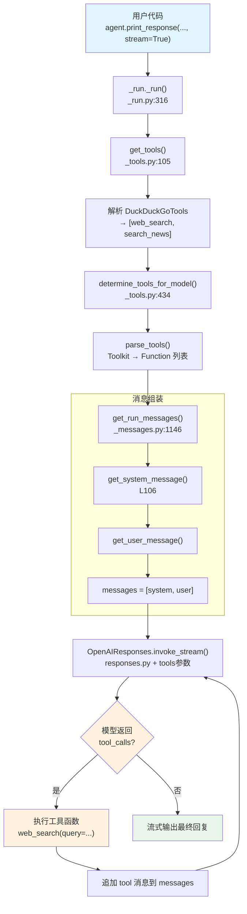

# agent_with_tools.py — 实现原理分析

> 源文件：`cookbook/02_agents/01_quickstart/agent_with_tools.py`

## 概述

本示例展示 Agno 的 **工具调用（Tool Use）** 机制：通过 `tools=[DuckDuckGoTools()]` 为 Agent 注入网络搜索能力。当模型判断需要搜索时，Agno 自动执行工具函数并将结果反馈给模型，形成 **Agentic Loop**（工具调用循环）。

**核心配置一览：**

| 配置项 | 值 | 说明 |
|--------|------|------|
| `name` | `"Tool-Enabled Agent"` | Agent 名称 |
| `model` | `OpenAIResponses(id="gpt-5.2")` | OpenAI Responses API |
| `tools` | `[DuckDuckGoTools()]` | DuckDuckGo 搜索工具集（含 web_search + search_news） |
| `instructions` | `None` | 未设置 |
| `description` | `None` | 未设置 |
| `markdown` | `False` | 默认不启用 |
| `tool_call_limit` | `None` | 无工具调用次数限制 |
| `tool_choice` | `None` | 默认 auto（有工具时由模型自行决定） |
| `search_knowledge` | `True` | 默认开启，但无 knowledge 不生效 |

## 架构分层

```
用户代码层                       agno.agent 层
┌───────────────────────┐     ┌──────────────────────────────────────┐
│ agent_with_tools.py   │     │ _run._run()  L316                    │
│                       │     │  ├─ get_tools()  L105               │
│ tools=[               │     │  │   resolve → [DuckDuckGoTools]     │
│   DuckDuckGoTools()   │────>│  │                                   │
│ ]                     │     │  ├─ determine_tools_for_model() L434│
│                       │     │  │   Toolkit → [web_search,          │
│                       │     │  │              search_news]          │
│                       │     │  │                                   │
│                       │     │  ├─ get_run_messages()  L1146       │
│                       │     │  │   → [system, user]                │
│                       │     │  │                                   │
│                       │     │  └─ Agentic Loop:                   │
│                       │     │      invoke() → tool_call?           │
│                       │     │      → 执行工具 → 再次 invoke()     │
└───────────────────────┘     └──────────────────────────────────────┘
                                       │
                                       ▼
                              ┌────────────────────┐
                              │ OpenAIResponses L31 │
                              │ id="gpt-5.2"       │
                              │ tools=[             │
                              │   web_search,       │
                              │   search_news       │
                              │ ]                   │
                              └────────────────────┘
```

## 核心组件解析

### DuckDuckGoTools 工具集

`DuckDuckGoTools`（`tools/duckduckgo.py:6`）继承自 `WebSearchTools`（`tools/websearch.py:16`），后者继承自 `Toolkit`：

```python
# duckduckgo.py:6 — 便捷包装器
class DuckDuckGoTools(WebSearchTools):
    def __init__(self, enable_search=True, enable_news=True, ...):
        super().__init__(backend=backend or "duckduckgo", ...)  # L43

# websearch.py:66-72 — 注册工具函数
tools: List[Any] = []
if enable_search:
    tools.append(self.web_search)    # 网页搜索
if enable_news:
    tools.append(self.search_news)   # 新闻搜索
super().__init__(name="websearch", tools=tools)  # L72
```

默认注册 2 个工具函数：`web_search`（L74）和 `search_news`。

### 工具解析流程

**第一步：`get_tools()`**（`_tools.py:105`）收集 Agent 的所有工具：

```python
def get_tools(agent, run_response, run_context, session, ...):
    agent_tools = []
    resolve_callable_tools(agent, run_context)       # L123 解析可调用工厂
    resolved_tools = get_resolved_tools(agent, run_context)  # L126
    if resolved_tools is not None:
        agent_tools.extend(resolved_tools)           # L136 添加 DuckDuckGoTools
    return agent_tools
```

**第二步：`determine_tools_for_model()`**（`_tools.py:434`）将 Toolkit 转换为 Function 列表：

```python
def determine_tools_for_model(agent, model, processed_tools, ...):
    _functions = parse_tools(                        # L448
        agent, tools=processed_tools, model=model, ...)
    for func in _functions:
        if isinstance(func, Function):
            func._run_context = run_context          # L471 注入运行上下文
    return _functions
```

### 工具传递给模型

`OpenAIResponses.get_request_params()`（`responses.py:187`）将工具格式化为 API 参数：

```python
if tools:
    request_params["tools"] = self._format_tool_params(  # L264
        messages=messages, tools=tools)
```

每个函数被转为 JSON Schema 格式：

```json
{
    "type": "function",
    "function": {
        "name": "web_search",
        "description": "Use this function to search the web for a query.",
        "parameters": {
            "type": "object",
            "properties": {
                "query": {"type": "string", "description": "The query to search for."},
                "max_results": {"type": "integer", "default": 5}
            },
            "required": ["query"]
        }
    }
}
```

### Agentic Loop（工具调用循环）

当模型返回 `tool_calls` 时，`_run()` 中的循环机制自动处理：

1. 模型返回包含 `tool_calls` 的响应
2. Agno 解析 `tool_calls`，找到对应的 `Function` 对象
3. 执行函数（如 `web_search(query="AI safety news")`）
4. 将工具执行结果作为 `tool` 角色消息追加到 messages
5. 再次调用模型，直到模型不再请求工具调用

### web_search 函数

`web_search()`（`websearch.py:74`）使用 DDGS 库搜索：

```python
def web_search(self, query: str, max_results: int = 5) -> str:
    """Use this function to search the web for a query."""
    # 使用 DDGS 客户端搜索，返回 JSON 格式结果
```

## System Prompt 组装

| 序号 | 组成部分 | 本文件中的值/来源 | 是否生效 |
|------|---------|-----------------|---------|
| 1 | `system_message`（自定义） | `None` | 否 |
| 3.1 | `instructions` | `None` | 否 |
| 3.1.1 | 模型指令（`get_instructions_for_model`） | gpt-5.2 + tools | 可能 |
| 3.2.1 | `markdown` | `False` | 否 |
| 3.2.2 | `add_datetime_to_context` | `False` | 否 |
| 3.2.3 | `add_location_to_context` | `False` | 否 |
| 3.2.4 | `add_name_to_context` | `False` | 否 |
| 3.3.1 | `description` | `None` | 否 |
| 3.3.2 | `role` | `None` | 否 |
| 3.3.3 | instructions 拼接 | 空或仅含模型指令 | 取决于 3.1.1 |
| 3.3.4 | additional_information | 空列表 | 否 |
| 3.3.5 | `_tool_instructions` | 工具使用说明（如有） | 可能 |
| 3.3.7 | `expected_output` | `None` | 否 |
| 3.3.8 | `additional_context` | `None` | 否 |
| 3.3.9 | `add_memories_to_context` | `None` | 否 |

### 最终 System Prompt

```text
（基本为空，可能包含推理模型指令和工具使用说明）
```

> 本示例未设置 `instructions`，system prompt 主要由模型自动注入的指令和 `_tool_instructions` 组成。

## 完整 API 请求

```python
# 第一轮：发送用户问题 + 工具声明
client.responses.create(
    model="gpt-5.2",
    input=[
        # 1. System Message（可能含工具使用说明）
        {"role": "developer", "content": "..."},
        # 2. 用户输入
        {"role": "user", "content": "Find one recent AI safety headline and summarize it."}
    ],
    tools=[
        {
            "type": "function",
            "function": {
                "name": "web_search",
                "description": "Use this function to search the web for a query.",
                "parameters": {
                    "type": "object",
                    "properties": {
                        "query": {"type": "string"},
                        "max_results": {"type": "integer", "default": 5}
                    },
                    "required": ["query"]
                }
            }
        },
        {
            "type": "function",
            "function": {
                "name": "search_news",
                "description": "Use this function to search for news about a query.",
                "parameters": {
                    "type": "object",
                    "properties": {
                        "query": {"type": "string"},
                        "max_results": {"type": "integer", "default": 5}
                    },
                    "required": ["query"]
                }
            }
        }
    ],
    reasoning={},
    stream=True
)

# 第二轮（模型调用了 web_search 后）：
client.responses.create(
    model="gpt-5.2",
    input=[
        {"role": "developer", "content": "..."},
        {"role": "user", "content": "Find one recent AI safety headline and summarize it."},
        {"role": "assistant", "tool_calls": [{"function": {"name": "web_search", "arguments": "{\"query\": \"AI safety news 2026\"}"}}]},
        {"role": "tool", "tool_call_id": "...", "content": "[搜索结果 JSON]"}
    ],
    tools=[...],
    reasoning={},
    stream=True
)
```

> **Agentic Loop**：模型决定调用工具 → Agno 执行 `web_search()` → 结果送回模型 → 模型生成最终回复。可能多轮循环。

## Mermaid 流程图



## 关键源码文件索引

| 文件 | 关键函数/类 | 作用 |
|------|------------|------|
| `agno/tools/duckduckgo.py` | `DuckDuckGoTools` L6 | DuckDuckGo 搜索工具集（继承 WebSearchTools） |
| `agno/tools/websearch.py` | `WebSearchTools` L16 | 通用搜索 Toolkit，注册 web_search + search_news |
| `agno/tools/websearch.py` | `web_search()` L74 | 网页搜索函数，使用 DDGS 库 |
| `agno/agent/agent.py` | `tools` L159 | 工具列表属性定义 |
| `agno/agent/agent.py` | `tool_choice` L169 | 工具选择策略（默认 auto） |
| `agno/agent/_tools.py` | `get_tools()` L105 | 收集 Agent 所有工具 |
| `agno/agent/_tools.py` | `determine_tools_for_model()` L434 | Toolkit → Function 转换 + 上下文注入 |
| `agno/agent/_run.py` | `_run()` L316 | Agent 核心执行循环（含 Agentic Loop） |
| `agno/agent/_messages.py` | `get_system_message()` L106 | 构建 system prompt |
| `agno/agent/_messages.py` | `get_run_messages()` L1146 | 组装完整消息列表 |
| `agno/models/openai/responses.py` | `get_request_params()` L187 | 构建 API 参数（含 tools 格式化 L263-264） |
| `agno/models/openai/responses.py` | `invoke()` L574 | 调用 `client.responses.create()` |
