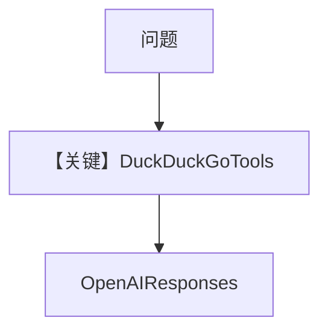

# agent_with_tools.py — 实现原理分析

<!-- cookbook-py-source:start -->
## 完整源码

```python
"""
Agent With Tools
=============================

Agent With Tools Quickstart.
"""

from agno.agent import Agent
from agno.models.openai import OpenAIResponses
from agno.tools.duckduckgo import DuckDuckGoTools

# ---------------------------------------------------------------------------
# Create Agent
# ---------------------------------------------------------------------------
agent = Agent(
    name="Tool-Enabled Agent",
    model=OpenAIResponses(id="gpt-5.2"),
    tools=[DuckDuckGoTools()],
)

# ---------------------------------------------------------------------------
# Run Agent
# ---------------------------------------------------------------------------
if __name__ == "__main__":
    agent.print_response(
        "Find one recent AI safety headline and summarize it.", stream=True
    )
```

<!-- cookbook-py-source:end -->

> 源文件：`cookbook/02_agents/01_quickstart/agent_with_tools.py`

## 概述

**`DuckDuckGoTools`** + **`OpenAIResponses`**，演示 **无 instructions 显式字符串** 时仅靠 **工具** 与 **模型默认** 完成联网查询。

**核心配置一览：**

| 配置项 | 值 |
|--------|-----|
| `name` | `"Tool-Enabled Agent"` |
| `model` | `OpenAIResponses(id="gpt-5.2")` |
| `tools` | `[DuckDuckGoTools()]` |

## 架构分层

```
get_tools → DuckDuckGo → Responses tool loop
```

## 核心组件解析

**#3.1** 可能仅有模型侧 `get_instructions_for_model`；用户未设 `instructions` 则列表为空或仅模型段。

### 运行机制与因果链

工具循环直至模型输出最终文本。

## System Prompt 组装

若无 `instructions`，**#3.3.3** 可能为空，但仍可能有 **#3.3.5 tool instructions**（`_tool_instructions`）。

### 还原后的完整 System 文本

无法静态列出用户 instructions；请运行时打印 `get_system_message`。**模型与工具**会提供默认行为。

## 完整 API 请求

**OpenAIResponses** + function tools。

## Mermaid 流程图


```mermaid
flowchart TD
    A["问题"] --> B["【关键】DuckDuckGoTools"]
    B --> C["OpenAIResponses"]
```

## 关键源码文件索引

| 文件 | 关键函数/类 | 作用 |
|------|------------|------|
| `agno/agent/agent.py` | `get_tools` | 工具注册 |
