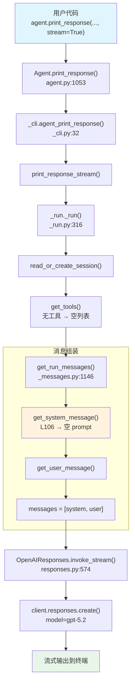

# basic_agent.py — 实现原理分析

> 源文件：`cookbook/02_agents/01_quickstart/basic_agent.py`

## 概述

本示例展示 Agno 最基础的 **Agent 创建与运行** 机制：仅传入 `name` 和 `model` 两个参数，即可构建一个可对话的 AI Agent，并通过 `print_response()` 以流式方式输出回复。这是理解 Agno Agent 生命周期的最小入口。

**核心配置一览：**

| 配置项 | 值 | 说明 |
|--------|------|------|
| `name` | `"Quickstart Agent"` | Agent 名称 |
| `model` | `OpenAIResponses(id="gpt-5.2")` | OpenAI Responses API |
| `instructions` | `None` | 未设置 |
| `tools` | `None` | 未设置 |
| `description` | `None` | 未设置 |
| `markdown` | `False` | 默认不启用 markdown 格式化 |
| `build_context` | `True` | 默认构建上下文 |
| `stream` | `None` | 未设置，由 print_response 参数控制 |

## 架构分层

```
用户代码层                     agno.agent 层
┌──────────────────────┐    ┌──────────────────────────────────────┐
│ basic_agent.py       │    │ Agent.print_response()  L1053        │
│                      │    │  └─ _cli.agent_print_response() L32  │
│ name="Quickstart     │    │      └─ print_response_stream()      │
│       Agent"         │    │          └─ _run._run()  L316        │
│ model=OpenAI         │───>│             ├─ get_system_message()  │
│   Responses(         │    │             │   L106 → 空 prompt     │
│   id="gpt-5.2")     │    │             │                         │
│                      │    │             ├─ get_run_messages()     │
│ stream=True          │    │             │   L1146 → [sys, user]  │
│                      │    │             │                         │
└──────────────────────┘    │             └─ Model.invoke_stream() │
                            └──────────────────────────────────────┘
                                    │
                                    ▼
                           ┌────────────────────┐
                           │ OpenAIResponses L31 │
                           │ id="gpt-5.2"       │
                           │ role_map: system    │
                           │   → developer  L84 │
                           └────────────────────┘
```

## 核心组件解析

### Agent 构造

`Agent` 在 `agno/agent/agent.py:67` 定义为 `@dataclass(init=False)`，所有参数均有默认值：

```python
@dataclass(init=False)
class Agent:
    model: Optional[Model] = None        # L70 模型实例
    name: Optional[str] = None           # L72 Agent 名称
    build_context: bool = True           # L223 是否构建上下文
    markdown: bool = False               # L237 是否启用 markdown
```

本示例仅设置 `name` 和 `model`，其余全部使用默认值。

### print_response 调用链

`print_response()`（`agent.py:1053`）委托给 `_cli.agent_print_response()`（`_cli.py:32`）：

```python
# _cli.py:74-76 — stream 参数解析
if stream is None:
    stream = False if agent.stream is None else agent.stream
# 用户传入 stream=True → 走 print_response_stream()
if stream:
    print_response_stream(agent=agent, input=input, ...)  # L82
```

### _run 主循环

`_run()`（`_run.py:316`）是 Agent 核心执行函数，16 个步骤：

```python
def _run(agent, run_response, run_context, session_id, ...):
    # 1. 读取或创建 session                        L380-384
    agent_session = read_or_create_session(agent, ...)
    # 5. 确定工具（本示例无工具 → 空列表）           L427-441
    processed_tools = agent.get_tools(...)
    _tools = determine_tools_for_model(agent, ...)
    # 6. 准备消息列表                               L443-460
    run_messages = get_run_messages(agent, ..., tools=_tools)
    # 9. 调用模型生成响应                            → invoke_stream()
```

### System Message 构建（空 prompt）

`get_system_message()`（`_messages.py:106`）中，`system_message=None` 且 `build_context=True`，进入步骤 3 构建默认 system message：

```python
# 3.1 instructions=None → instructions=[]                L163-174
# 3.1.1 get_instructions_for_model() → 可能有推理模型指令  L177-179
# 3.2 所有 additional_information 开关都为 False           L181-225
# 3.3.1 description=None → 不追加                        L230
# 3.3.3 instructions 为空 → 不追加                        L236
# 3.3.4 additional_information 为空 → 不追加              L252
```

最终 `system_message_content` 基本为空（可能仅含推理模型自动注入的指令）。

### OpenAIResponses 模型

`OpenAIResponses`（`models/openai/responses.py:31`）使用 Responses API，关键特征：

```python
role_map: Dict[str, str] = field(default_factory=lambda: {
    "system": "developer",   # L86 Responses API 用 developer 角色
    "user": "user",           # L87
    "assistant": "assistant", # L88
})

def invoke(self, messages, ...):                           # L574
    provider_response = self.get_client().responses.create(
        model=self.id,                                     # "gpt-5.2"
        input=self._format_messages(messages, ...),        # L596
        **request_params,
    )
```

gpt-5.2 是推理模型（`_using_reasoning_model()` L93-95 返回 True），`_set_reasoning_request_param()` 会自动添加 `reasoning` 参数。

## System Prompt 组装

| 序号 | 组成部分 | 本文件中的值/来源 | 是否生效 |
|------|---------|-----------------|---------|
| 1 | `system_message`（自定义） | `None` | 否 |
| 3.1 | `instructions` | `None` | 否 |
| 3.1.1 | 模型指令（`get_instructions_for_model`） | gpt-5.2 推理模型，可能注入指令 | 可能 |
| 3.2.1 | `markdown` | `False` | 否 |
| 3.2.2 | `add_datetime_to_context` | `False` | 否 |
| 3.2.3 | `add_location_to_context` | `False` | 否 |
| 3.2.4 | `add_name_to_context` | `False` | 否 |
| 3.3.1 | `description` | `None` | 否 |
| 3.3.2 | `role` | `None` | 否 |
| 3.3.3 | instructions 拼接 | 空列表 | 否 |
| 3.3.4 | additional_information | 空列表 | 否 |
| 3.3.5 | `_tool_instructions` | `None` | 否 |
| 3.3.7 | `expected_output` | `None` | 否 |
| 3.3.8 | `additional_context` | `None` | 否 |
| 3.3.9 | `add_memories_to_context` | `None` | 否 |

### 最终 System Prompt

```text
（基本为空字符串，可能仅含推理模型自动注入的指令）
```

## 完整 API 请求

```python
client.responses.create(
    model="gpt-5.2",
    input=[
        # 1. System Message（role_map: system → developer）
        {"role": "developer", "content": ""},
        # 2. 用户输入
        {"role": "user", "content": "Say hello and introduce yourself in one sentence."}
    ],
    reasoning={},  # gpt-5.2 推理模型自动添加
    stream=True
)
```

> Responses API 使用 `input` 参数（非 `messages`），role 经 `role_map`（L84）映射 `system→developer`。

## Mermaid 流程图



## 关键源码文件索引

| 文件 | 关键函数/类 | 作用 |
|------|------------|------|
| `agno/agent/agent.py` | `Agent` L67 | Agent 数据类定义，所有属性默认值 |
| `agno/agent/agent.py` | `print_response()` L1053 | 用户调用入口，委托给 `_cli` |
| `agno/agent/_cli.py` | `agent_print_response()` L32 | 解析 stream 参数，分发流式/非流式 |
| `agno/agent/_run.py` | `_run()` L316 | Agent 核心 16 步执行循环 |
| `agno/agent/_messages.py` | `get_system_message()` L106 | 构建 system prompt（本示例为空） |
| `agno/agent/_messages.py` | `get_run_messages()` L1146 | 组装完整消息列表 [system, user] |
| `agno/models/openai/responses.py` | `OpenAIResponses` L31 | Responses API 模型适配 |
| `agno/models/openai/responses.py` | `role_map` L84 | system→developer 角色映射 |
| `agno/models/openai/responses.py` | `invoke()` L574 | 调用 `client.responses.create()` |
| `agno/models/openai/responses.py` | `_using_reasoning_model()` L93 | 判断 gpt-5.x 为推理模型 |
