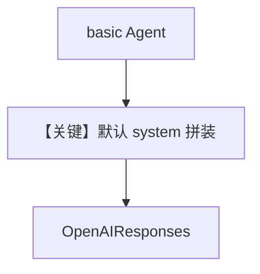

# basic_agent.py — 实现原理分析

> 源文件：`cookbook/02_agents/01_quickstart/basic_agent.py`

## 概述

**最小 Agent**：仅 **`name` + `OpenAIResponses`**，无 `instructions`、无 tools，用于验证 **默认 system** 与 **`print_response`** 流式路径。

**核心配置一览：**

| 配置项 | 值 |
|--------|-----|
| `name` | `"Quickstart Agent"` |
| `model` | `OpenAIResponses(id="gpt-5.2")` |

## 架构分层

```
Agent.run → get_system_message（可能仅模型默认段）→ Responses
```

## 核心组件解析

无自定义 instructions 时，**#3.1** 的 `instructions` 列表可能为空；仍走 **build_context True** 的默认分支。

### 运行机制与因果链

与 `agent_with_instructions` 对比：本示例**无业务指令**，完全依赖模型默认行为。

## System Prompt 组装

### 还原后的完整 System 文本

无用户 `instructions` 字面量；可能仅有 **模型 `get_instructions_for_model`** 与 **附加信息**（若开启 markdown 等）。请运行时验证。

## 完整 API 请求

**OpenAIResponses**。

## Mermaid 流程图


```mermaid
flowchart TD
    A["basic Agent"] --> B["【关键】默认 system 拼装"]
    B --> C["OpenAIResponses"]
```

## 关键源码文件索引

| 文件 | 关键函数/类 | 作用 |
|------|------------|------|
| `agno/agent/_messages.py` | `get_system_message()` | 默认路径 |
