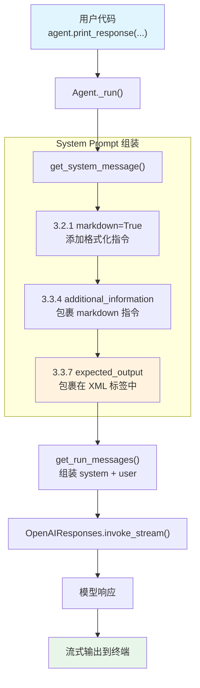

# expected_output.py — 实现原理分析

> 源文件：`cookbook/02_agents/02_input_output/expected_output.py`

## 概述

本示例展示 Agno 的 **`expected_output`** 机制：通过在 Agent 构造时设置 `expected_output` 参数，将期望的输出格式以 `<expected_output>` XML 标签注入 system prompt，引导模型按指定格式生成响应。

**核心配置一览：**

| 配置项 | 值 | 说明 |
|--------|------|------|
| `model` | `OpenAIResponses(id="gpt-5.2")` | Responses API |
| `expected_output` | `"A numbered list of exactly 5 items, each with a title and one-sentence description."` | 期望输出格式 |
| `markdown` | `True` | 启用 markdown 格式化指令 |
| `name` | `None` | 未设置 |
| `instructions` | `None` | 未设置 |
| `description` | `None` | 未设置 |
| `tools` | `None` | 未设置 |

## 架构分层

```
用户代码层                       agno.agent 层
┌────────────────────────┐    ┌──────────────────────────────────────┐
│ expected_output.py     │    │ Agent._run()                         │
│                        │    │  ├ _messages.py                      │
│ expected_output=       │───>│  │  get_system_message()              │
│   "A numbered list..." │    │  │    → 3.2.1 markdown 指令           │
│ markdown=True          │    │  │    → 3.3.7 expected_output 注入    │
│                        │    │  │                                    │
│ print_response(        │    │  │  get_run_messages()                │
│   "What are...",       │    │  │    → system + user message         │
│   stream=True)         │    │  │                                    │
└────────────────────────┘    └──────────────────────────────────────┘
                                        │
                                        ▼
                              ┌──────────────────┐
                              │ OpenAIResponses   │
                              │ gpt-5.2           │
                              │ Responses API     │
                              └──────────────────┘
```

## 核心组件解析

### expected_output

`expected_output` 在 `get_system_message()`（`_messages.py:271-272`）中处理：

```python
# 3.3.7 将 expected_output 包裹在 XML 标签中追加到 system message
if agent.expected_output is not None:
    system_message_content += f"<expected_output>\n{agent.expected_output.strip()}\n</expected_output>\n\n"
```

该参数告诉模型应产出的**格式和结构**，但不干预内容本身。与 `output_schema`（强制 JSON schema）不同，`expected_output` 是软约束——通过 prompt 引导而非 API 层面强制。

### markdown

`markdown` 在 `get_system_message()`（`_messages.py:184-185`）中处理：

```python
# 3.2.1 当 markdown=True 且无 output_schema 时，添加格式化指令
if agent.markdown and output_schema is None:
    additional_information.append("Use markdown to format your answers.")
```

## System Prompt 组装

| 序号 | 组成部分 | 本文件中的值/来源 | 是否生效 |
|------|---------|-----------------|---------|
| 1 | `system_message`（自定义） | `None` | 否 |
| 2 | `build_context=False` | `True`（默认） | 否（不跳过） |
| 3.1 | `instructions` | `None` | 否 |
| 3.1.1 | 模型指令（`get_instructions_for_model`） | OpenAIResponses 默认 | 视模型而定 |
| 3.2.1 | `markdown` | `True` | 是 |
| 3.2.2 | `add_datetime_to_context` | `False` | 否 |
| 3.2.3 | `add_location_to_context` | `False` | 否 |
| 3.2.4 | `add_name_to_context` | `False` | 否 |
| 3.3.1 | `description` | `None` | 否 |
| 3.3.2 | `role` | `None` | 否 |
| 3.3.3 | instructions 拼接 | 无 | 否 |
| 3.3.4 | additional_information | markdown 指令 | 是 |
| 3.3.5 | `_tool_instructions` | `None` | 否 |
| 3.3.7 | `expected_output` | `"A numbered list..."` | 是 |
| 3.3.8 | `additional_context` | `None` | 否 |
| 3.3.9 | `add_memories_to_context` | `None` | 否 |

### 最终 System Prompt

```text
<additional_information>
- Use markdown to format your answers.
</additional_information>

<expected_output>
A numbered list of exactly 5 items, each with a title and one-sentence description.
</expected_output>
```

## 完整 API 请求

```python
client.responses.create(
    model="gpt-5.2",
    input=[
        # 1. System Message（role_map: system → developer）
        {"role": "developer", "content": "<additional_information>\n- Use markdown to format your answers.\n</additional_information>\n\n<expected_output>\nA numbered list of exactly 5 items, each with a title and one-sentence description.\n</expected_output>\n\n"},
        # 2. 用户输入
        {"role": "user", "content": "What are the most important principles of clean code?"}
    ],
    stream=True,
    stream_options={"include_usage": True}
)
```

> OpenAIResponses 的 `role_map`（`responses.py:84`）将 `system` 映射为 `developer`。

## Mermaid 流程图



## 关键源码文件索引

| 文件 | 关键函数/类 | 作用 |
|------|------------|------|
| `agno/agent/agent.py` | `expected_output` L233 | Agent 属性定义 |
| `agno/agent/agent.py` | `markdown` L237 | markdown 格式化开关 |
| `agno/agent/_messages.py` | `get_system_message()` L106 | 构建 system prompt |
| `agno/agent/_messages.py` | 步骤 3.2.1 L184-185 | markdown 指令注入 |
| `agno/agent/_messages.py` | 步骤 3.3.7 L271-272 | expected_output 注入 |
| `agno/agent/_messages.py` | `get_run_messages()` L1146 | 组装完整消息列表 |
| `agno/models/openai/responses.py` | `role_map` L84 | system → developer 映射 |
| `agno/models/openai/responses.py` | `invoke()` L574 | 发送 API 请求 |
