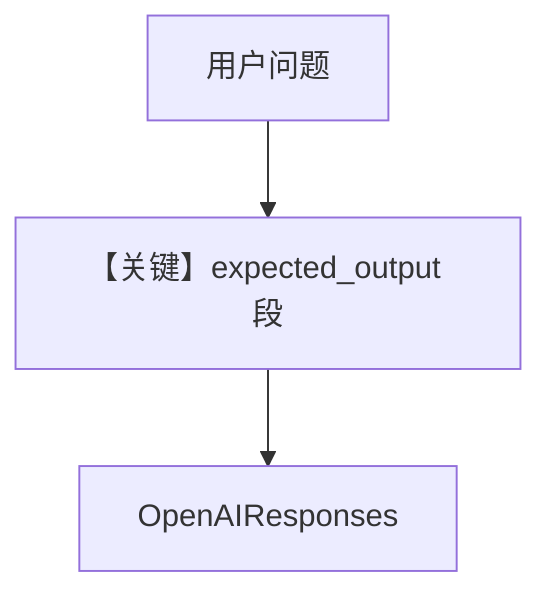

# expected_output.py — 实现原理分析

> 源文件：`cookbook/02_agents/02_input_output/expected_output.py`

## 概述

展示 **`expected_output`**：在 system 中注入 **`<expected_output>...</expected_output>`**（**#3.3.7**，`_messages.py` L276-L277），约束回答形态（本例：5 条编号列表各含标题与一句描述）。**`markdown=True`** 时若同轮无 `output_schema` 则仍追加 markdown 提示（**#3.2.1**）。

**核心配置一览：**

| 配置项 | 值 |
|--------|-----|
| `model` | `OpenAIResponses(id="gpt-5.2")` |
| `expected_output` | 英文长句，指定 5 项编号列表结构 |
| `markdown` | `True` |

## 架构分层

```
expected_output → system 尾部 XML 段 → 用户问题 → Responses
```

## 核心组件解析

### #3.3.7 expected_output

与 `output_schema` 不同：仍是**自然语言约束**，非 JSON schema。

### 运行机制与因果链

主路径同标准 Agent；约束通过 **system** 传达。

## System Prompt 组装

### 还原后的完整 System 文本

```text
<expected_output>
A numbered list of exactly 5 items, each with a title and one-sentence description.
</expected_output>

```

（前后尚有 #3.2.1 markdown 行、#3.2.2 时间等，若未关闭；本示例未设 `instructions` 与 `add_datetime_to_context`，以默认为准。）

实际以运行时为准：本文件**未设 `instructions`**，故 **#3.3.3 可能为空**；**`markdown=True`** 会触发附加段。

## 完整 API 请求

**OpenAIResponses**，流式 `print_response`。

## Mermaid 流程图


```mermaid
flowchart TD
    A["用户问题"] --> B["【关键】expected_output 段"]
    B --> C["OpenAIResponses"]
```

## 关键源码文件索引

| 文件 | 关键函数/类 | 作用 |
|------|------------|------|
| `agno/agent/_messages.py` | `#3.3.7` L276-277 | expected_output 注入 |
