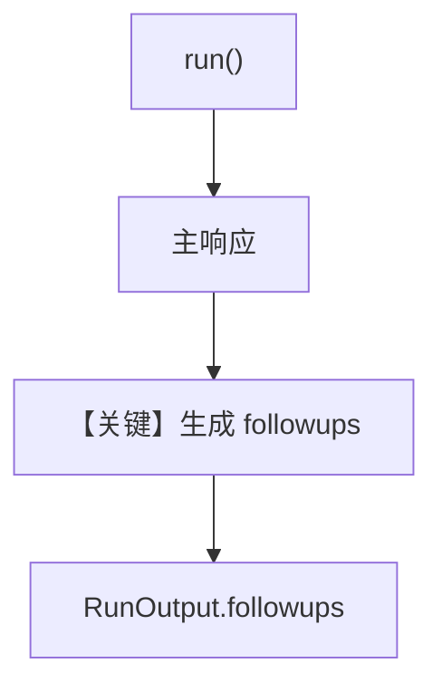

# followup_suggestions.py — 实现原理分析

> 源文件：`cookbook/02_agents/02_input_output/followup_suggestions.py`

## 概述

**`followups=True`**：主答仍自由生成；结束后框架再发起 **跟进问题生成**，结果写入 **`RunOutput.followups`**。**可选 `followup_model`** 降本。演示 **非流式** `run`。

**核心配置一览：**

| 配置项 | 值 |
|--------|-----|
| `model` | `OpenAIResponses(id="gpt-4o")` |
| `instructions` | 助手角色 |
| `followups` | `True` |
| `num_followups` | `3` |
| `markdown` | `True` |

## 架构分层

```
主模型回答 → 跟进子流程 → followups 列表附加到 RunOutput
```

## 核心组件解析

### followups 与 system

跟进生成通常用**独立内部调用**，不混在首条 user 消息；具体见 `agno/agent/_run.py` 中 followup 生成逻辑。

### 运行机制与因果链

1. **路径**：一次 `run` 可能 **2+ 次**模型调用（主答 + 跟进）。
2. **副作用**：无额外存储除非配 db。

## System Prompt 组装

主对话 system 仍由 **`instructions` + markdown** 等构成；**跟进调用**可有独立 prompt（框架内部）。

### 还原后的完整 System 文本（主 Agent）

```text
You are a knowledgeable assistant. Answer questions thoroughly.

Use markdown to format your answers.

<additional_information>
- The current time is <运行时>。
</additional_information>
```

（`add_datetime` 若默认 false 则无时间行——本示例未显式设置，以 Agent 默认为准。）

## 完整 API 请求

主：**OpenAIResponses**；跟进：同模型或 `followup_model`。

## Mermaid 流程图



## 关键源码文件索引

| 文件 | 关键函数/类 | 作用 |
|------|------------|------|
| `agno/agent/agent.py` | `followups` L307+ | 配置 |
| `agno/agent/_run.py` | followup 生成 | 第二次调用 |
