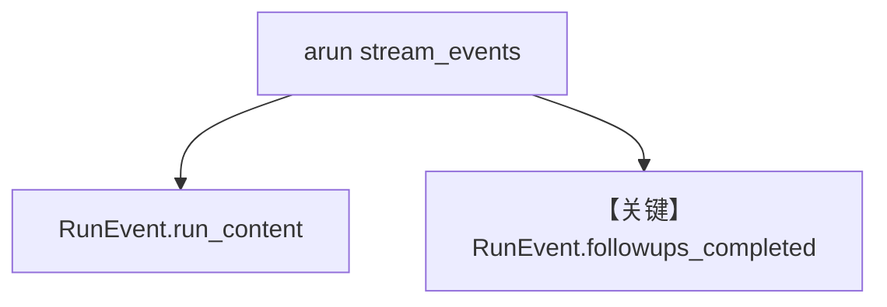

# followup_suggestions_streaming.py — 实现原理分析

> 源文件：`cookbook/02_agents/02_input_output/followup_suggestions_streaming.py`

## 概述

**`stream=True` + `stream_events=True`**：通过 **`RunEvent.run_content`** 流式主文，通过 **`RunEvent.followups_completed`** 在末尾一次性拿到 **followups**。**`SqliteDb` + `add_history_to_context`** 持久会话。

**核心配置一览：**

| 配置项 | 值 |
|--------|-----|
| `model` | `OpenAIResponses(id="gpt-4o")` |
| `followups` / `num_followups` | `True` / 默认 |
| `db` | `SqliteDb(tmp/agents.db)` |
| `session_id` | `"test-session"` |
| `add_history_to_context` | `True` |

## 架构分层

```
arun(stream_events=True) → 异步事件流 → 区分 content 与 followups_completed
```

## 核心组件解析

### RunEvent

事件类型分支见示例 `main()`（`followup_suggestions_streaming.py` L40-63）。

### 运行机制与因果链

1. **路径**：异步流；适合 UI 逐 token 渲染并在结束显示建议问题。
2. **副作用**：SQLite 会话历史。

## System Prompt 组装

与同步 followups 类似；主 Agent instructions 为 knowledgeable assistant。

## 完整 API 请求

**异步 `ainvoke` 路径** + Responses。

## Mermaid 流程图



## 关键源码文件索引

| 文件 | 关键函数/类 | 作用 |
|------|------------|------|
| `agno/run/agent.py` | `RunEvent` | 事件枚举 |
| `agno/agent/agent.py` | `arun` | 异步流 |
