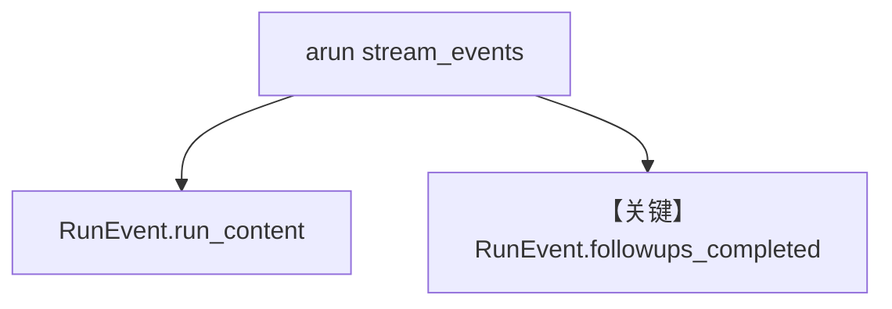

# followup_suggestions_streaming.py — 实现原理分析

<!-- cookbook-py-source:start -->
## 完整源码

```python
"""
Followups — Streaming
=====================

Stream the main response token-by-token and capture followup suggestions
via events at the end.

Key concepts:
- stream=True, stream_events=True: enables streaming with events
- RunEvent.run_content: tokens of the main response
- RunEvent.followups_completed: carries the finished followup suggestions
"""

import asyncio

from agno.agent import Agent, RunEvent
from agno.db.sqlite import SqliteDb
from agno.models.openai import OpenAIResponses

db = SqliteDb(db_file="tmp/agents.db")

# ---------------------------------------------------------------------------
# Create the Agent
# ---------------------------------------------------------------------------
agent = Agent(
    model=OpenAIResponses(id="gpt-4o"),
    instructions="You are a knowledgeable assistant. Answer questions thoroughly.",
    session_id="test-session",
    followups=True,
    num_followups=3,
    markdown=True,
    db=db,
    add_history_to_context=True,
)


# ---------------------------------------------------------------------------
# Stream the response and capture followups from events
# ---------------------------------------------------------------------------
async def main():
    content_started = False
    async for event in agent.arun(
        "Which national park is the best?",
        stream=True,
        stream_events=True,
    ):
        # Stream response tokens
        if event.event == RunEvent.run_content:
            if not content_started:
                print("Response:")
                print("=" * 60)
                content_started = True
            if event.content:
                print(event.content, end="", flush=True)

        # Followups arrive as a single completed event
        if event.event == RunEvent.followups_completed:
            print(f"\n\n{'=' * 60}")
            print("Followups:")
            print("=" * 60)
            if event.followups:  # type: ignore
                for i, suggestion in enumerate(event.followups, 1):  # type: ignore
                    print(f"  {i}. {suggestion}")

    print()


if __name__ == "__main__":
    asyncio.run(main())
```

<!-- cookbook-py-source:end -->

> 源文件：`cookbook/02_agents/02_input_output/followup_suggestions_streaming.py`

## 概述

**`stream=True` + `stream_events=True`**：通过 **`RunEvent.run_content`** 流式主文，通过 **`RunEvent.followups_completed`** 在末尾一次性拿到 **followups**。**`SqliteDb` + `add_history_to_context`** 持久会话。

**核心配置一览：**

| 配置项 | 值 |
|--------|-----|
| `model` | `OpenAIResponses(id="gpt-4o")` |
| `followups` / `num_followups` | `True` / 默认 |
| `db` | `SqliteDb(tmp/agents.db)` |
| `session_id` | `"test-session"` |
| `add_history_to_context` | `True` |

## 架构分层

```
arun(stream_events=True) → 异步事件流 → 区分 content 与 followups_completed
```

## 核心组件解析

### RunEvent

事件类型分支见示例 `main()`（`followup_suggestions_streaming.py` L40-63）。

### 运行机制与因果链

1. **路径**：异步流；适合 UI 逐 token 渲染并在结束显示建议问题。
2. **副作用**：SQLite 会话历史。

## System Prompt 组装

与同步 followups 类似；主 Agent instructions 为 knowledgeable assistant。

## 完整 API 请求

**异步 `ainvoke` 路径** + Responses。

## Mermaid 流程图



## 关键源码文件索引

| 文件 | 关键函数/类 | 作用 |
|------|------------|------|
| `agno/run/agent.py` | `RunEvent` | 事件枚举 |
| `agno/agent/agent.py` | `arun` | 异步流 |
