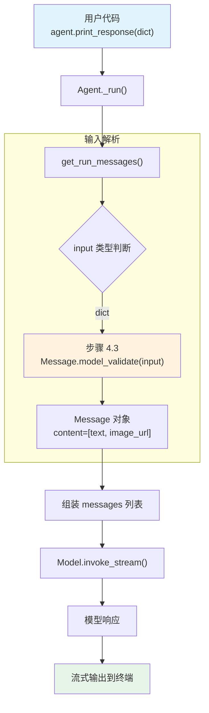

# input_formats.py — 实现原理分析

> 源文件：`cookbook/02_agents/02_input_output/input_formats.py`

## 概述

本示例展示 Agno 的 **多模态输入格式** 机制：用户可以直接传入 OpenAI 格式的 `dict` 消息（含 `role`、`content` 数组），Agent 会在 `get_run_messages()` 中将其解析为 `Message` 对象。本例演示了图文混合输入（`text` + `image_url`）的传递方式。

**核心配置一览：**

| 配置项 | 值 | 说明 |
|--------|------|------|
| `model` | `None`（默认） | 使用默认模型 |
| `name` | `None` | 未设置 |
| `instructions` | `None` | 未设置 |
| `description` | `None` | 未设置 |
| `tools` | `None` | 未设置 |
| `markdown` | `False`（默认） | 未设置 |

> 注意：`markdown=True` 和 `stream=True` 在本例中通过 `print_response()` 的参数传入，���是 Agent 构造参数。

## 架构分层

```
用户代码层                       agno.agent 层
┌────────────────────────┐    ┌──────────────────────────────────────┐
│ input_formats.py       │    │ Agent._run()                         │
│                        │    │  ├ _messages.py                      │
│ Agent()                │    │  │  get_system_message()              │
│   无额外参数           │───>│  │    → build_context=True            │
│                        │    │  │    → 但无 description/instructions │
│ print_response(        │    │  │    → 可能返回空 system message     │
│   {"role":"user",      │    │  │                                    │
│    "content":[         │    │  │  get_run_messages()                │
│      {text},           │    │  │    步骤 4.3: dict → Message        │
│      {image_url}       │    │  │    Message.model_validate(input)   │
│    ]},                 │    │  │                                    │
│   stream=True,         │    │  │                                    │
│   markdown=True)       │    │  │                                    │
└────────────────────────┘    └──────────────────────────────────────┘
                                        │
                                        ▼
                              ┌──────────────────┐
                              │ 默认模型          │
                              │ (OpenAIResponses) │
                              └──────────────────┘
```

## 核心组件解析

### dict 输入解析

当 `input` 为 `dict` 类型时，`get_run_messages()`（`_messages.py:1297-1307`）中通过步骤 4.3 处理：

```python
# 4.3 如果 input 是 dict，尝试验证为 Message
elif isinstance(input, dict):
    try:
        if agent.input_schema and is_typed_dict(agent.input_schema):
            import json
            content = json.dumps(input, indent=2, ensure_ascii=False)
            user_message = Message(role=agent.user_message_role, content=content)
        else:
            # 将 dict 直接验证为 Message 对象
            user_message = Message.model_validate(input)
    except Exception as e:
        log_warning(f"Failed to validate message: {e}")
```

本例中无 `input_schema`，所以走 `Message.model_validate(input)` 分支，直接将 `{"role": "user", "content": [...]}` 解析为包含多模态内容的 `Message` 对象。

### 多模态 content 数组

OpenAI API 支持 `content` 为数组格式，每个元素可以是：
- `{"type": "text", "text": "..."}` — 文本内容
- `{"type": "image_url", "image_url": {"url": "..."}}` — 图片 URL

Agno 的 `Message` 模型通过 Pydantic 的 `model_validate` 直接支持该格式。

## System Prompt 组装

| 序号 | 组成部分 | 本文件中的值/来源 | 是否生效 |
|------|---------|-----------------|---------|
| 1 | `system_message`（自定义） | `None` | 否 |
| 2 | `build_context=False` | `True`（默认） | 否（不跳过） |
| 3.1 | `instructions` | `None` | 否 |
| 3.1.1 | 模型指令（`get_instructions_for_model`） | 默认模型指令 | 视模型而定 |
| 3.2.1 | `markdown` | `False`（Agent 层） | 否 |
| 3.2.2 | `add_datetime_to_context` | `False` | 否 |
| 3.2.3 | `add_location_to_context` | `False` | 否 |
| 3.2.4 | `add_name_to_context` | `False` | 否 |
| 3.3.1 | `description` | `None` | 否 |
| 3.3.2 | `role` | `None` | 否 |
| 3.3.3 | instructions 拼接 | 无 | 否 |
| 3.3.4 | additional_information | 无 | 否 |
| 3.3.5 | `_tool_instructions` | `None` | 否 |
| 3.3.7 | `expected_output` | `None` | 否 |
| 3.3.8 | `additional_context` | `None` | 否 |
| 3.3.9 | `add_memories_to_context` | `None` | 否 |

### 最终 System Prompt

由于所有配置项均为默认值（无 description、instructions 等），最终 system prompt 可能为空字符串或仅包含模型默认指令。

## 完整 API 请求

```python
client.responses.create(
    model="gpt-4o",  # 默认模型
    input=[
        # 1. 用户输入（多模态 content 数组，直接从 dict 解析）
        {
            "role": "user",
            "content": [
                {"type": "text", "text": "What's in this image?"},
                {
                    "type": "image_url",
                    "image_url": {
                        "url": "https://upload.wikimedia.org/wikipedia/commons/thumb/d/dd/Gfp-wisconsin-madison-the-nature-boardwalk.jpg/2560px-Gfp-wisconsin-madison-the-nature-boardwalk.jpg"
                    }
                }
            ]
        }
    ],
    stream=True,
    stream_options={"include_usage": True}
)
```

> 当 Agent 无实质性 system prompt 内容时，system message 可能被省略。

## Mermaid 流程图



## 关键源码文件索引

| 文件 | 关键函数/类 | 作用 |
|------|------------|------|
| `agno/agent/agent.py` | `Agent` 类定义 L67 | Agent 默认参数 |
| `agno/agent/_messages.py` | `get_run_messages()` L1146 | 组装完整消息列表 |
| `agno/agent/_messages.py` | 步骤 4.3 L1297-1307 | dict 输入 → Message 解析 |
| `agno/agent/_messages.py` | `get_system_message()` L106 | 构建 system prompt |
