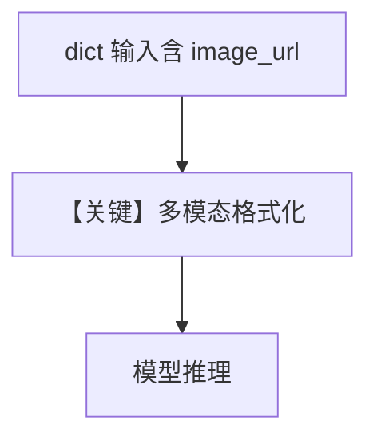

# input_formats.py — 实现原理分析

> 源文件：`cookbook/02_agents/02_input_output/input_formats.py`

## 概述

演示 **`print_response`** 接受 **类 Chat 多模态消息 dict**（`role` + `content` 数组含 **text** 与 **image_url**）。**`Agent()`** 无显式 model（依赖框架默认或环境，**生产应显式指定 model**）。

**核心配置一览：**

| 配置项 | 值 |
|--------|-----|
| `agent` | `Agent()` 无参 |

## 架构分层

```
结构化输入 → 模型适配器序列化为提供商消息格式 → 多模态推理
```

## 核心组件解析

图片 URL 由 **OpenAI/OpenAIResponses** 等多模态路径支持；具体映射见 `Model._format_messages`。

### 运行机制与因果链

单轮问答；无 tools。

## System Prompt 组装

无显式 instructions；system 可能极短或仅模型默认。

### 还原后的完整 System 文本

请运行时打印；本文件未提供 `instructions`/`description`。

## 完整 API 请求

多模态 **Responses/Chat** 请求，含 **image_url** 部分。

## Mermaid 流程图


```mermaid
flowchart TD
    A["dict 输入含 image_url"] --> B["【关键】多模态格式化"]
    B --> C["模型推理"]
```

## 关键源码文件索引

| 文件 | 关键函数/类 | 作用 |
|------|------------|------|
| `agno/models/openai/responses.py` | `_format_messages` | 消息转换 |
